# Estrutura Curricular

## Disciplinas de natureza obrigatória

| Sigla | Nome da Disciplina | Requisitos | Núcleo |
|------------|------------|------------|------------|
| IME-AL | [Álgebra Linear](#álgebra-linear) |  | NC |
| INF-AED1 | [Algoritmos e Estruturas de Dados 1](#algoritmos-e-estruturas-de-dados-1) | [INF-IP](#introdução-à-programação) | NC |
| INF-AED2 | [Algoritmos e Estruturas de Dados 2](#algoritmos-e-estruturas-de-dados-2) | [INF-AED1](#algoritmos-e-estruturas-de-dados-1) | NC |
| INF-APA | [Análise e Projeto de Algoritmos](#análise-e-projeto-de-algoritmos) | [INF-AED2](#algoritmos-e-estruturas-de-dados-2) | NC |
| INF-ARQ | [Arquitetura de Computadores](#arquitetura-de-computadores) |  | NC  |
| INF-BD | [Banco de Dados](#banco-de-dados) |  | NC |
| IME-C1A | [Cálculo 1A](#cálculo-1a) |  | NC |
| IME-C2A | [Cálculo 2A](#cálculo-2a) | [IME-C1A](#cálculo-1a) (co) | NE |
| IME-CN | [Cálculo Numérico](#cálculo-numérico) | [IME-EDO](#equações-diferenciais-ordinárias) | NE |
| EMC-CD | [Circuitos Digitais](#circuitos-digitais) |  | NE |
| INF-COMP | [Compiladores](#compiladores) | [INF-LFA](#linguagens-formais-e-autômatos) | NE |
| INF-CS | [Computação e Sociedade](#computação-e-sociedade) |  | NC |
| INF-CG | [Computação Gráfica](#computação-gráfica) | [IME-GA](#geometria-analítica); [IME-AL](#álgebra-linear) | NE  |
| INF-CP | [Computação Paralela](#computação-paralela) |  | NE |
| INF-ES | [Engenharia de Software](#engenharia-de-software) |  | NC |
| IME-EDO | [Equações Diferenciais Ordinárias](#equações-diferenciais-ordinárias) | [IME-C2A](#cálculo-2a) | NE |
| IF-F1 | [Física I](#física-i) | [IME-C1A](#cálculo-1a) (co) | NE |
| IF-FE1 | [Física Experimental I](#física-experimental-i) | [IF-F1](#física-i) (co) | NE |
| INF-FMC | [Fundamentos de Matemática para Computação](#fundamentos-de-matemática-para-computação) |  | NC |
| IME-GA | [Geometria Analítica](#geometria-analítica) |  | NE |
| INF-IA | [Inteligência Artificial](#inteligência-artificial) | [IME-PEA](#probabilidade-e-estatística-a) | NE |
| INF-IHC | [Interação Humano-Computador](#interação-humano-computador) |  | NC |
| INF-ICCC | [Introdução à Computabilidade e à Complexidade Computacional](#introdução-à-computabilidade-e-à-complexidade-computacional) | [INF-LFA](#linguagens-formais-e-autômatos); [INF-APA](#análise-e-projeto-de-algoritmos) | NE |
| INF-IP | [Introdução à Programação](#introdução-à-programação) |  | NC |
| INF-LPP | [Linguagens e Paradigmas de Programação](#linguagens-e-paradigmas-de-programação) |  | NC |
| INF-LFA | [Linguagens Formais e Autômatos](#linguagens-formais-e-autômatos) | [INF-FMC](#fundamentos-de-matemática-para-computação) | NE |
| INF-LM | [Lógica Matemática](#lógica-matemática) | [INF-MD](#matemática-discreta) | NC |
| INF-MD | [Matemática Discreta](#matemática-discreta) | [INF-FMC](#fundamentos-de-matemática-para-computação) | NE |
| INF-MPC | [Metodologia de Pesquisa em Computação](#metodologia-de-pesquisa-em-computação) |  | NE |
| INF-PO | [Pesquisa Operacional](#pesquisa-operacional) | [IME-AL](#álgebra-linear) | NE |
| IME-PEA | [Probabilidade e Estatística A](#probabilidade-e-estatística-a) | [IME-C1A](#cálculo-1a) | NC |
| INF-POO | [Programação Orientada a Objetos](#programação-orientada-a-objetos) | [INF-IP](#introdução-à-programação) | NC |
| INF-PFC1 | [Projeto Final de Curso 1]() |  | NE |
| INF-PFC2 | [Projeto Final de Curso 2]() |  | NE |
| INF-RC | [Redes de Computadores 1]() |  | NE |
| INF-SD | [Sistemas Distribuídos]() |  | NE |
| INF-SO | [Sistemas Operacionais]() |  | NE |
| INF-SB | [Software Básico]() | [INF-ARQ](#arquitetura-de-computadores) | NE |
| INF-TG | [Teoria dos Grafos]() | [INF-MD](#matemática-discreta) | NE |
#

## Disciplinas de natureza optativa

| Sigla | Nome da Disciplina | Requisitos | Núcleo |
|------------|------------|------------|------------|
| INF-AA | [Algoritmos de Aproximação]() | [INF-APA](#análise-e-projeto-de-algoritmos) | NE |
| INF-AG | [Algoritmos em Grafos]() | [INF-TG]() | NE |
| INF-AMC | [Aplicações de Microcontroladores]() | [INF-MICRO]() | NE |
| INF-AM | [Aprendizado de Máquina]() |  | NE |
| INF-AMNS | [Aprendizado de Máquina Não Supervisionado]() | [INF-IA](#inteligência-artificial) | NE |
| INF-AMS | [Aprendizado de Máquina Supervisionado]() | [INF-IA](#inteligência-artificial) | NE |
| INF-APR | [Aprendizado de Máquina por Reforço]() |  | NE |
| INF-AD | [Armazém de Dados]() |  | NE |
| INF-AS | [Arquitetura de Software]() |  | NE |
| INF-ADSC | [Avaliação de Desempenho de Sistemas Computacionais]() |  | NE |
| INF-BDD | [Banco de Dados Distribuídos]() |  | NE |
| INF-CC | [Classes de Grafos]() | [INF-TG]() | NE |
| INF-CPAR | [Complexidade Parametrizada]() | [INF-ICCC](#introdução-à-computabilidade-e-à-complexidade-computacional) | NE |
| INF-CAD | [Computação de Alto Desempenho]() |  | NE |
| INF-CE | [Computação Evolucionária]() |  | NE |
| INF-CMU | [Computação Móvel e Ubíqua]() |  | NE |
| INF-CVERDE | [Computação Verde]() |  | NE |
| INF-DSW | [Desenvolvimento de Sistemas para Web]() |  | NE |
| INF-DSDM | [Desenvolvimento de Software Dirigido por Modelos]() |  | NE |
| INF-ELET | [Eletrônica para Computação]() |  | NE |
| INF-ED | [Empreendedorismo Digital]() | [INF-IAE]() | NE |
| INF-ESIS | [Engenharia de Sistemas]() |  | NE |
| INF-ESI1 | [Engenharia de Sistemas de Informação 1]() |  | NE |
| INF-ESI2 | [Engenharia de Sistemas de Informação 2]() | [INF-ESI1]() | NE |
| INF-ESBB | [Engenharia de Software Baseada em Busca]() |  | NE |
| IF-F3 | [Física 3]() | [IF-F1](#física-i) | NE |
| IF-FE3 | [Física Experimental 3]() | [IF-FE1](#física-experimental-i) | NE |
| INF-FR | [Fluxos em Redes]() | [INF-TG](); [INF-PO](#pesquisa-operacional) | NE |
| INF-FOTO | [Fotogrametria]() |  | NE |
| INF-FLP | [Fundamentos de Linguagem de Programação]() | [INF-LC]() | NE |
| INF-GPS | [Gerência de Projeto de Software]() |  | NE |
| INF-GPSSI | [Gerenciamento de Processos e Serviços em SI]() | [INF-IAE]() | NE |
| INF-GSI | [Gestão de Segurança da Informação]() | [INF-RC]() | NE |
| INF-GSTI | [Gestão de Sistemas de TI]() | [INF-IAE]() | NE |
| INF-GCTI | [Governança Corporativa e de TI]() | [INF-IAE]() | NE |
| INF-HMM | [Heurísticas e Modelagem Multiobjetivo]() |  | NE |
| INF-IIS | [Implementação e Integração de Software]() | [INF-PS]() | NE |
| INF-IVC | [Infraestruturas Virtualizadas de Computação]() |  | NE |
| INF-ID | [Integração de Dados]() |  | NE |
| INF-IOT | [Internet das Coisas]() |  | NE |
| INF-IAE | [Introdução à Administração de Empresas]() |  | NE |
| IF-ICQ | [Introdução à Computação Quântica]() | [IME-AL](#álgebra-linear) | NE |
| FL-ILBS | [Introdução à Língua Brasileira de Sinais]() |  | NE |
| INF-IRM | [Introdução à Robótica Móvel]() |  | NE |
| INF-ITP | [Introdução à Teoria das Provas]() |  | NE |
| INF-ITT | [Introdução à Teoria dos Tipos]() |  | NE |
| INF-ISI | [Introdução aos Sistemas de Informação]() |  | NE |
| INF-JD | [Jogos Digitais]() |  | NE |
| INF-LC | [Lógica em Computação]() | [INF-LM](#lógica-matemática); [INF-PF]() | NE |
| INF-MES | [Mercado e Economia de Software]() |  | NE |
| INF-MH | [Meta-heurísticas]() |  | NE |
| INF-MEES | [Metodologia e Experimentação em Engenharia de Software]() |  | NE |
| INF-MICRO | [Microcontroladores]() | [EMC-CD](#circuitos-digitais) | NE |
| INF-MSD | [Middleware para Sistemas Distribuídos]() |  | NE |
| INF-MDADOS | [Mineração de Dados]() |  | NE |
| INF-MC | [Modelos de Concorrência]() | [INF-LC]() | NE |
| INF-PAR | [Percepção e Ação Robótica]() | [INF-VC]() | NE |
| INF-PDM | [Processamento de Dados Massivo]() |  | NE |
| INF-PLN | [Processamento de Linguagem Natural]() |  | NE |
| INF-PDI  | [Processamento Digital de Imagens]() |  | NE |
| INF-PDSI | [Processamento Digital de Sinais e Imagens]() |  | NE |
| INF-PC | [Programação Concorrente]() |  | NE |
| INF-PF | [Programação Funcional]() | [INF-LC]() | NE |
| INF-PL | [Programação Linear]() |  | NE |
| INF-PS  | [Projeto de Software]() | [INF-POO](#programação-orientada-a-objetos) | NE |
| INF-PI1 | [Projeto Integrador 1]() |  | NE |
| INF-PI2  | [Projeto Integrador 2]() |  | NE |
| INF-RI  | [Recuperação de Informação]() |  | NE |
| INF-RC2 | [Redes de Computadores 2]() |  | NE |
| INF-RNA | [Redes Neurais Artificiais]() |  | NE |
| INF-RNP | [Redes Neurais Profundas]() |  | NE |
| INF-RSF | [Redes sem Fio]() |  | NE |
| INF-RS | [Requisitos de Software]() |  | NE |
| INF-SAS | [Segurança e Auditoria de Sistemas]() |  | NE |
| INF-SE | [Sistemas Embarcados]() |  | NE |
| INF-SGBD | [Sistemas Gerenciadores de Banco de Dados]() |  | NE |
| INF-SM | [Sistemas Multiagentes]() |  | NE |
| INF-SDM | [Software para Dispositivos Móveis]() | [INF-PS]() | NE |
| INF-SPD | [Software para Persistência de Dados]() | [INF-SGBD]() | NE |
| INF-SSU | [Software para Sistemas Ubíquos]() | [INF-IIS]() | NE |
| INF-TG2 | [Teoria dos Grafos II]() | [INF-TG]() | NE |
| INF-TS | [Teste de Software]() |  | NE |
| INF-TARSF | [Tópicos Avançados em Redes Sem Fio]() |  | NE |
| INF-TSI | [Tópicos Avançados em Sistemas de Informação 1]() |  | NE |
| INF-TC | [Tópicos em Computação]() |  | NE |
| INF-TCF | [Tópicos em Computação Física]() |  | NE |
| INF-TCV | [Tópicos em Computação Visual]() |  | NE |
| INF-TES | [Tópicos em Engenharia de Software]() |  | NE |
| INF-TBD | [Tópicos em Gerência de Dados]() |  | NE |
| INF-TIA  | [Tópicos em Inteligência Artificial]() |  | NE |
| INF-TLSC | [Tópicos em Lógica e Semântica de Computação]() | [INF-PF]() | NE |
| INF-TSC | [Tópicos em Sistemas de Computação]() |  | NE |
| INF-TTS | [Tópicos em Teste de Software]() |  | NE |
| INF-TECC | [Tópicos Especiais em Complexidade da Computação]() | [INF-APA](#análise-e-projeto-de-algoritmos); [INF-ICCC](#introdução-à-computabilidade-e-à-complexidade-computacional) | NE |
| INF-VFP  | [Verificação Formal de Programas]() | [INF-LC]() | NE |
| INF-VC | [Visão Computacional]() | [INF-PDI]() | NE |
| INF-VR | [Visão Robótica]() |  | NE |
| INF-VI | [Visualização de Informações]() |  | NE |
| INF-WS  | [Web Semântica]() |  | NE |
#
# Ementas e Bibliografias dos Componentes Curriculares

## ÁLGEBRA LINEAR
Sistemas lineares e matrizes. Espaços vetoriais. Transformações lineares. Autovalores e autovetores. Espaços com produto interno.
#
| Livro | Nome da Obra | Autor | Idioma |
|------------|------------|------------|------------|
|  | [Álgebra Linear 3ed](./livros/Algebra_Linear_3ed.pdf) | BOLDRINI, J. L.; COSTA, S. I. R; FIGUEIREDO, V. L; WETZLER, H. G. |  |
| | [Introdução à álgebra linear: com aplicações 8ed](./livros/algebra_linear_com_aplicacoes_8ed.pdf) | KOLMAN, B.; HILL, D. R. |  |
|  | [Álgebra linear 4ed](./livros/algebra_linear_4ed.pdf) | LIPSCHUTZ, S. |  |
|  | [Álgebra linear e aplicações 6ed](./livros/algebra_linear_e_aplicacoes_6ed.pdf) | CALLIOLI, C. A.; DOMINGUES, H. H.; COSTA, R. C. F. |  |
|  | [Álgebra linear e aplicações 9ed](./livros/algebra_linear_e_aplicacoes_9ed.pdf) | CALLIOLI, C. A.; DOMINGUES, H. H.; COSTA, R. C. F. |  |
#
## ALGORITMOS E ESTRUTURAS DE DADOS 1
Noções de complexidade de algoritmos (notações de complexidade). Recursividade. Algoritmos de pesquisa: pesquisa sequencial e binária. Algoritmos de ordenação. Tipos abstratos de dados. Estruturas de dados utilizando vetores: pilhas, filas, listas (simples e circulares). Estruturas de dados com alocação dinâmica de memória: pilhas, filas, listas (simplesmente encadeadas, duplamente encadeadas e circulares).
#
| Livro | Nome da Obra | Autor | Idioma |
|------------|------------|------------|------------|
|  | [Estruturas de Dados Usando C](/livros/estruturas_de_dados_usando_c.pdf) | TENENBAUM, A. M., LANGSAM, Y., AUGENSTEIN, M. |  |
|  | [Estruturas de Dados e seus Algoritmos 2ed](/livros/estruturas_de_dados_e_seus_algoritmos_2ed.pdf) | SZWARCFITER, J. L., MARKENZON, L. |  |
|  | [Estruturas de Dados e seus Algoritmos 3ed](/livros/estruturas_de_dados_e_seus_algoritmos_3ed.pdf) | SZWARCFITER, J. L., MARKENZON, L. |  |
|  | [Algoritmos em Linguagem](/livros/algoritmos_em_linguagem_c.pdf) | FEOFILOFF, P. |  |
#
## ALGORITMOS E ESTRUTURAS DE DADOS 2
Árvores: formas de representação, recursão em árvores, árvores binárias, árvores binárias de busca, árvores balanceadas (AVL e rubro-negras). Filas de prioridades. Heaps, Heapsort. Hashing: tipos de funções de hashing; tratamento de colisões. Definições de Grafos. Estruturas de Dados para representação de grafos. Algoritmos básicos em grafos.
#
| Livro | Nome da Obra | Autor | Idioma |
|------------|------------|------------|------------|
|  | [Estruturas de Dados Usando C](/livros/estruturas_de_dados_usando_c.pdf) | TENENBAUM, A. M., LANGSAM, Y., AUGENSTEIN, M. |  |
|  | [Estruturas de Dados e seus Algoritmos 2ed](/livros/estruturas_de_dados_e_seus_algoritmos_2ed.pdf) | SZWARCFITER, J. L., MARKENZON, L. |  |
|  | [Estruturas de Dados e seus Algoritmos 3ed](/livros/estruturas_de_dados_e_seus_algoritmos_3ed.pdf) | SZWARCFITER, J. L., MARKENZON, L. |  |
|  | [Algoritmos em Linguagem](/livros/algoritmos_em_linguagem_c.pdf) | FEOFILOFF, P. |  |
#
## ANÁLISE E PROJETO DE ALGORITMOS
Medidas de complexidade, análise assintótica de limites de complexidade para algoritmos iterativos e recursivos, técnicas de prova de cotas inferiores. Corretude de Algoritmos. Exemplos de análise de algoritmos. Técnicas de projeto de algoritmos: dividir para conquistar, programação dinâmica, algoritmos gulosos. Introdução à NP-Completude.
#
| Livro | Nome da Obra | Autor | Idioma |
|------------|------------|------------|------------|
|  | [ Algoritmos: Teoria e Prática. 3ed](/livros/algoritmos_teoria_e_pratica_3ed.pdf) | CORMEN, T. H.; LEISERSON, C. E.; RIVEST, R. L.; STEIN, C. |  |
|  | [Fundamentals of Algorithmics](/livros/fundamentals_of_algorithms.pdf) | BRASSARD, G; BRATLEY, P. |  |
|  | [Algoritmos](/livros/algoritmos.pdf) | PAPADIMITRIOU, C. H.; VAZIRANI, U. V. |  |
#
## ARQUITETURA DE COMPUTADORES
Visão geral dos computadores modernos. Evolução da arquitetura dos computadores. Memória e representação de dados e instruções. Processador, ciclo de instrução, formato e endereçamento. Noções básicas de programação em linguagem de montagem. Dispositivos de entrada e saída. Sistemas de interconexão (barramentos). Interfaceamento e técnicas de entrada e saída. Hierarquia de memória. Introdução a arquiteturas paralelas e métricas de desempenho.
#
| Livro | Nome da Obra | Autor | Idioma |
|------------|------------|------------|------------|
|  | [Organização Estruturada de Computadores 6ed](/livros/organizaao_estruturada_de_computadores_6ed.pdf) | TANENBAUM, A. |  |
|  | [Arquitetura e Organização de Computadores 5ed](/livros/arquitetura_e_organizaao_de_computadores_5ed.pdf) | STALLINGS, W. |  |
|  | [Arquitetura e Organização de Computadores 10ed](/livros/arquitetura_e_organizaao_de_computadores_10ed.pdf) | STALLINGS, W. |  |
|  | [Computer Systems: A Programmer’s Perspective 2ed](/livros/computer_systems_a_programmers_erspective_2ed.pdf) | BRYANT, R.; O’RALLARON, D. |  |
|  | [Computer Systems: A Programmer’s Perspective 3ed](/livros/computer_systems_a_programmers_erspective_3ed.pdf) | BRYANT, R.; O’RALLARON, D. |  |
#
## BANCO DE DADOS
Conceitos básicos de Banco de Dados. Modelo relacional. Linguagens para Banco de Dados: álgebra relacional, cálculo relacional e SQL. Modelo Entidade-Relacionamento e extensões. Mapeamento ER-relacional. Normalização.
#
| Livro | Nome da Obra | Autor | Idioma |
|------------|------------|------------|------------|
|  | [Sistemas de Banco de Dados 6ed](/livros/sistemas_de_banco_de_dados_6ed.pdf) | ELMASRI, R.; NAVATHE, S. B.  |  |
|  | [Sistema de Banco de Dados 5ed](https://drive.google.com/file/d/1Vmh5b8JzCtqae9y0A4KlQDqkTaem31Ov/view?usp=drive_link) | SILBERSCHATZ, A.; KORTH, H.F.; SUDARSHAN, S. |  |
|  | [Projeto de Banco de Dados 6ed](/livros/projeto_de_banco_de_dados_6ed.pdf) | HEUSER, C. A. |  |
#
## CÁLCULO 1A
Números reais. Funções reais de uma variável real e suas inversas. Noções sobre cônicas. Limite e continuidade. Derivadas e aplicações. Polinômio de Taylor. Integrais. Técnicas de Integração. Integrais impróprias. Aplicações.
#
| Livro | Nome da Obra | Autor | Idioma |
|------------|------------|------------|------------|
|  | [O cálculo com geometria analítica V1 3ed](/livros/o_calculo_com_geometria_analitica_v1_3ed.pdf) | LEITHOLD, L.n|  |
|  | [Um curso de cálculo V1 5ed](/livros/um_curso_de_calculo_v1_5ed.pdf) | GUIDORIZZI, H. L |  |
|  | [Um curso de cálculo V1 6ed](/livros/um_curso_de_calculo_v1_6ed.pdf) | GUIDORIZZI, H. L |  |
|  | [Cálculo das funções de uma variável V1 7ed](/livros/calculo_das_funoes_de_uma_variavel_v1_7ed.pdf) | ÁVILA, G. S. S. |  |
|  | [Cálculo V1 5ed](/livros/calculo_v1_5ed.pdf) | STEWART, J.  |  |
|  | [Cálculo V1 7ed](/livros/calculo_v1_7ed.pdf) | STEWART, J.  |  |
#
## CÁLCULO 2A
Sequências e séries numéricas. Séries de potência, convergência. Funções de várias variáveis. Limite e Continuidade. Noções sobre quádricas. Funções diferenciáveis. Derivadas parciais e direcionais. Fórmula de Taylor. Máximos e mínimos. Integrais múltiplas. Mudança de Coordenadas. Aplicações.
#
| Livro | Nome da Obra | Autor | Idioma |
|------------|------------|------------|------------|
| 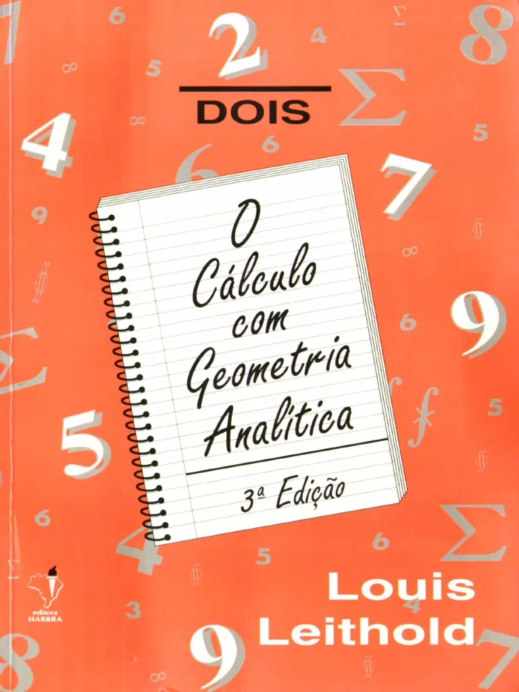 | [O cálculo com geometria analítica V2 3ed](/livros/o_calculo_com_geometria_analitica_v2_3ed.pdf) | LEITHOLD, L. |  |
| 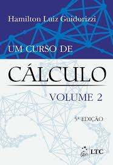 | [Um curso de cálculo V2 5ed](/livros/um_curso_de_calculo_v2_5ed.pdf) | GUIDORIZZI, H. L. |  |
| 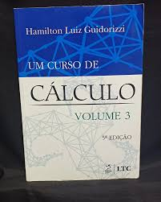 | [Um curso de cálculo V3 5ed](/livros/um_curso_de_calculo_v3_5ed.pdf) | GUIDORIZZI, H. L. |  |
|  | [Um curso de cálculo V2 6ed](/livros/um_curso_de_calculo_v3_5ed.pdf) | GUIDORIZZI, H. L. |  |
| 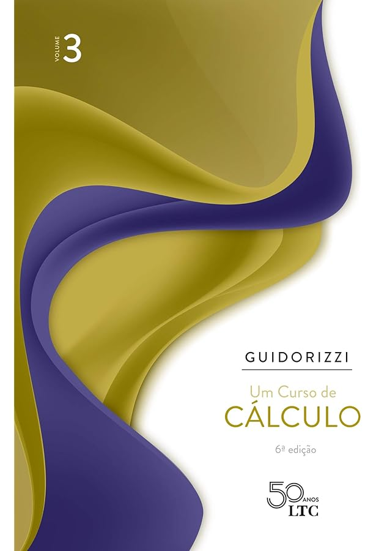 | [Um curso de cálculo V3 6ed](/livros/um_curso_de_calculo_v3_6ed.pdf) | GUIDORIZZI, H. L. |  |
| 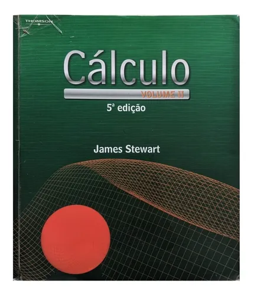 | [Cálculo V2 5ed](/livros/calculo_v2_5ed.pdf) | STEWART, J. |  |
| 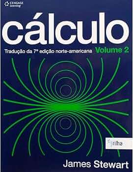 | [Cálculo V2 7ed](/livros/calculo_v2_7ed.pdf) | STEWART, J. |  |
#
## CÁLCULO NUMÉRICO
Resolução de sistemas lineares, métodos diretos e métodos iterativos. Integração e interpolação. Cálculo de raízes de equações. Resolução numérica de equações diferenciais.
#
| Livro | Nome da Obra | Autor | Idioma |
|------------|------------|------------|------------|
| 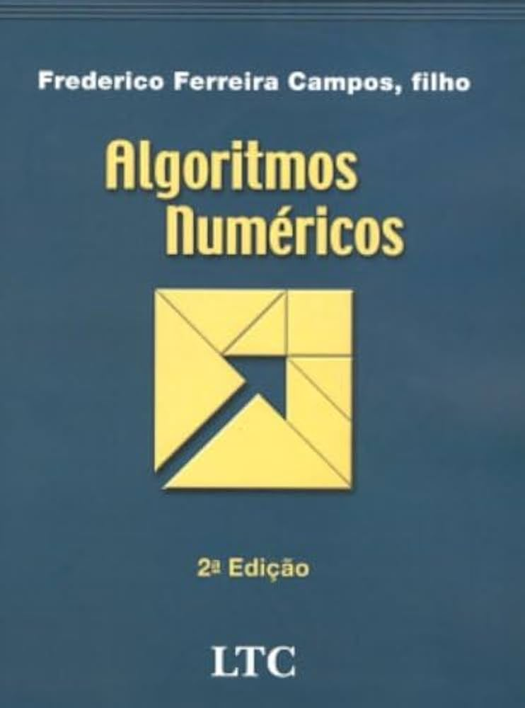 | [Algoritmos Numérico 2ed](/livros/algoritimos_numerico_2ed.pdf) | CAMPOS FILHO, F. F. |  |
| 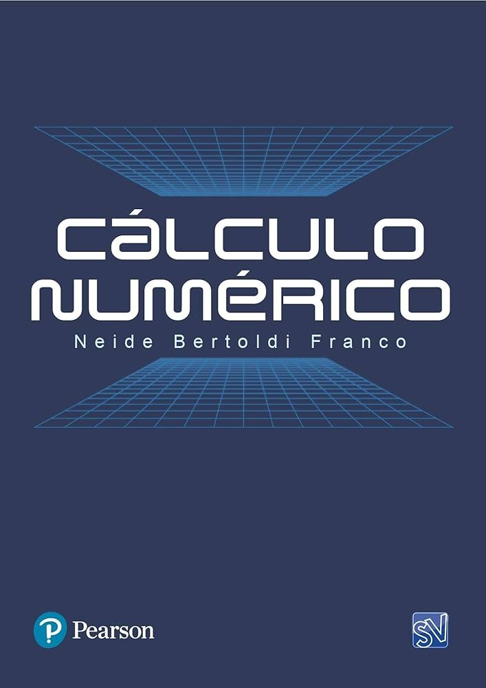 | [Cálculo Numérico](/livros/calculo_numerico.pdf) | FRANCO, N. B. |  |
| 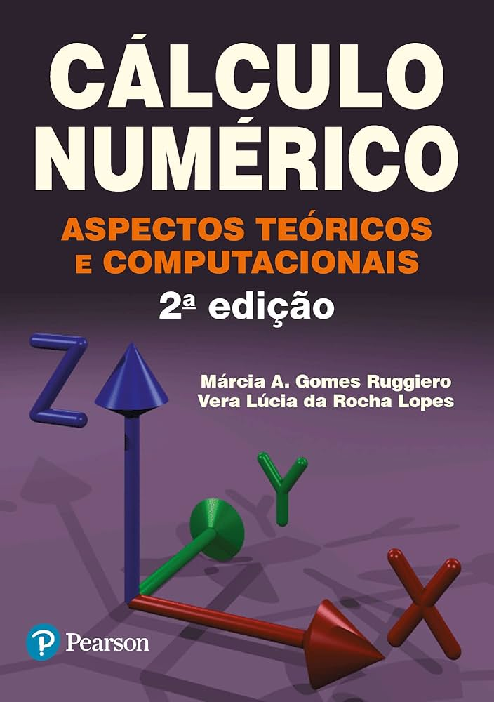 | [Cálculo Numérico: Aspectos teóricos e computacionais 2ed](/livros/calculo_numerico_aspectos_teoricos_e_computacionais_2ed.pdf) | RUGGIERO, M. A. G.; LOPES, V. L. R. |  |
#
## CIRCUITOS DIGITAIS
Álgebra booleana e portas lógicas. Introdução a Circuitos Combinacionais, Circuitos Seqüenciais e Famílias Lógicas de Circuitos Integrados. Técnicas de minimização e síntese de Circuitos Combinacionais e Circuitos Seqüenciais. Conversores Analógico-Digitais e Digitais-Analógicos. Dispositivos de memória
#
| Livro | Nome da Obra | Autor | Idioma |
|------------|------------|------------|------------|
| 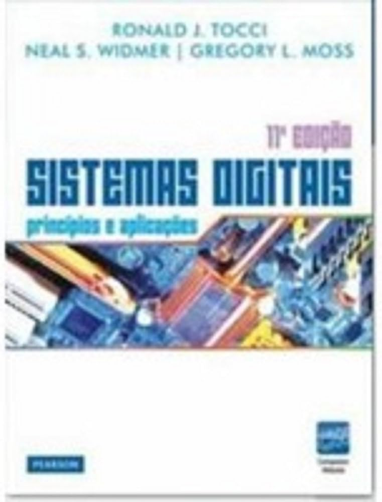 | [Sistemas Digitais – Princípios e Aplicações 11ed](/livros/sistemas_digitais_principios_e_aplicacoes_11ed.pdf) | TOCCI, R. J.; WIDMER, N. S.; MOSS, G. L. |  |
| 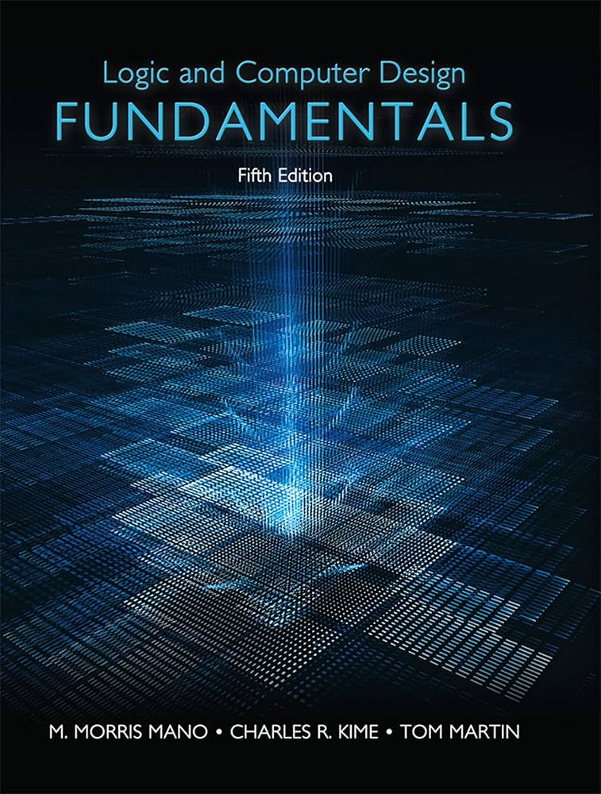 | [Logic & Computer Design Fundamentals 5ed](/livros/logic_and_computer_design_fundamentals_5ed.pdf) | MANO, M.; KIME, C. |  |
#
## COMPILADORES
A estrutura de um compilador. Análises léxica e sintática. Definições dirigidas por sintaxe e análise semântica. Organização da tabela de símbolos. Representação intermediária do programa-fonte. Geração do código-objeto da compilação. Introdução à otimização do código-objeto. Implementação de um compilador.
#
| Livro | Nome da Obra | Autor | Idioma |
|------------|------------|------------|------------|
| 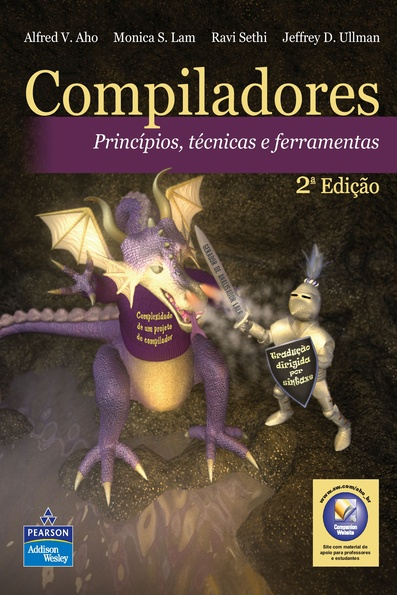 | [Compiladores - Princípios, técnicas e ferramentas 2ed](/livros/compiladores_principios_tecnicas_e_ferramantas_2ed.pdf) | AHO, A. V; LAM, M. S.; SETHI, R.; ULLMAN, J. |  |
| 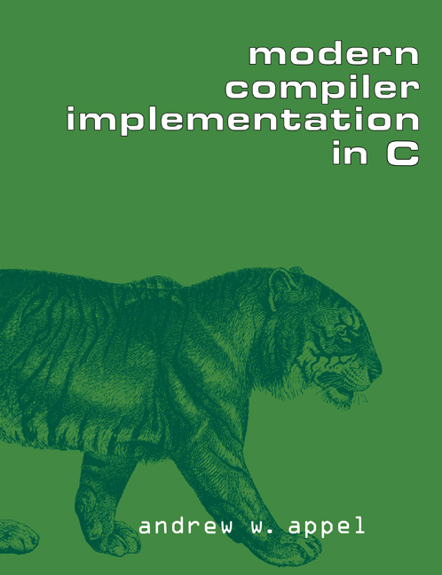 | [Modern Compiler Implementation in C - Basic Techiniques](/livros/modern_compiler_implementation_in_c_basic_techiniques.pdf) | APPEL, A. W. |  |
#
## COMPUTAÇÃO E SOCIEDADE
História da computação. Estudo e análise de casos de aplicação de computadores na sociedade e para o meio ambiente. Subáreas da computação e áreas interdisciplinares. Importância e desafios da computação no Brasil e no mundo. Cursos de computação e aspectos profissionais: tipos de cursos, perfis profissionais, demanda do mercado, organizações e associações na área, regulamentação da profissão. Leis e normas relacionadas à Informática. Questões ambientais, raciais, de saúde e de inclusão digital relacionadas à Computação. Ética na Computação. Empresas de tecnologia da informação. Incubadoras de empresas.
#
| Livro | Nome da Obra | Autor | Idioma |
|------------|------------|------------|------------|
|  | [História da computação: O Caminho do Pensamento e da Tecnologia](/livros/histooria_da_computacao_o_caminho_do_pensamento_e_da_tecnologia.pdf) | FONSECA FILHO, C. |  |
#
## COMPUTAÇÃO GRÁFICA
Origem e objetivos da Computação Gráfica. Dispositivos Vetoriais x Matriciais. Dispositivos de entrada e saída. Sistemas e equipamentos gráficos. Algoritmos para conversão matricial e preenchimento de primitivas gráficas. Transformações geométricas bi-dimensionais e tridimensionais. Transformações de projeção paralela e perspectiva. Recorte e seleção bi-dimensional. Curvas e Superfícies. Representação e Modelagem; Modelos de cor. Visualização tridimensional: iluminação, eliminação de linhas superfícies escondidas, modelos de tonalização (“shading”). Aplicação de texturas. Animação. Noções de processamento digital de imagens.
#
| Livro | Nome da Obra | Autor | Idioma |
|------------|------------|------------|------------|
| 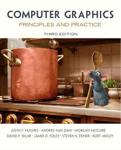 | [Computer Graphics: Principles and Practices](/livros/computer_graphics_principles_and_practice.pdf) | FOLEY, J. D. at al. |  |
#
## COMPUTAÇÃO PARALELA
Fundamentos da computação paralela. Classificação de computadores. Métricas de avaliação de desempenho de programas paralelos. Projeto e análise de algoritmos paralelos. Programação paralela com memória compartilhada. Programação paralela com memória distribuída.
#
| Livro | Nome da Obra | Autor | Idioma |
|------------|------------|------------|------------|
| 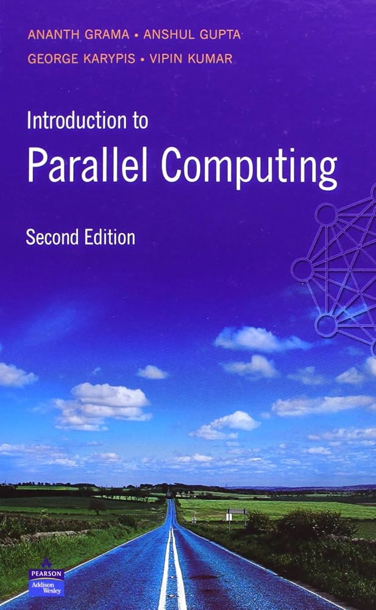 | [An Introduction to Parallel Computing, Design and Analysis of Algorithms 2ed](/livros/introduction_to_parallel_computing_2ed.pdf) | GRAMA, A.; KUMAR, V.; GUPTA, A.; KARYPIS, G. |  |
| 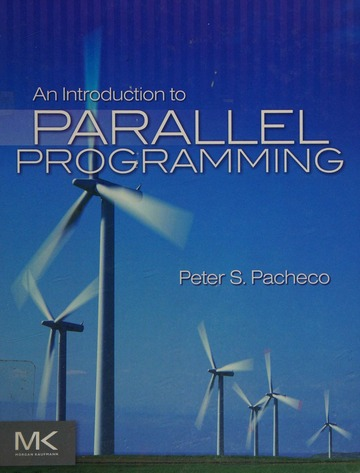 | [An Introduction to Parallel Programming](/livros/an_introduction_to_parallel_programming.pdf) | PACHECO, P. |  |
| 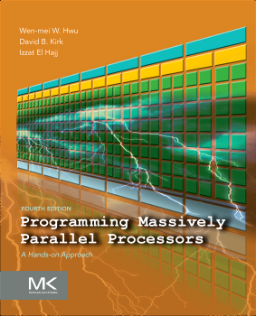 | [Programming Massively Parallel Processors: A Hands On Approach 2ed](/livros/programming_massively_parallel_processors_a_hands_on_approach_2ed.pdf) | KIRK, D.; HWU, W. |  |
#
## ENGENHARIA DE SOFTWARE
Requisitos de software. Projeto (design) de software. Construção de software. Teste de software. Manutenção de software. Gerência de configuração de software. Gerência de projeto de software. Processo de engenharia de software. Modelos e métodos de engenharia de software. Qualidade de software. Prática profissional de engenharia de software. Economia para engenharia de software. Fundamentos de engenharia.
#
| Livro | Nome da Obra | Autor | Idioma |
|------------|------------|------------|------------|
| 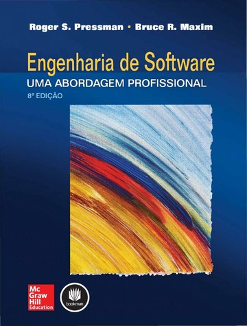 | [Engenharia De Software Uma Abordagem Profissional 8ed](/livros/engenharia_de_software_uma_abordagem_profissional_8ed.pdf) | PRESSMAN, R.; MAXIM, B. |  |
| 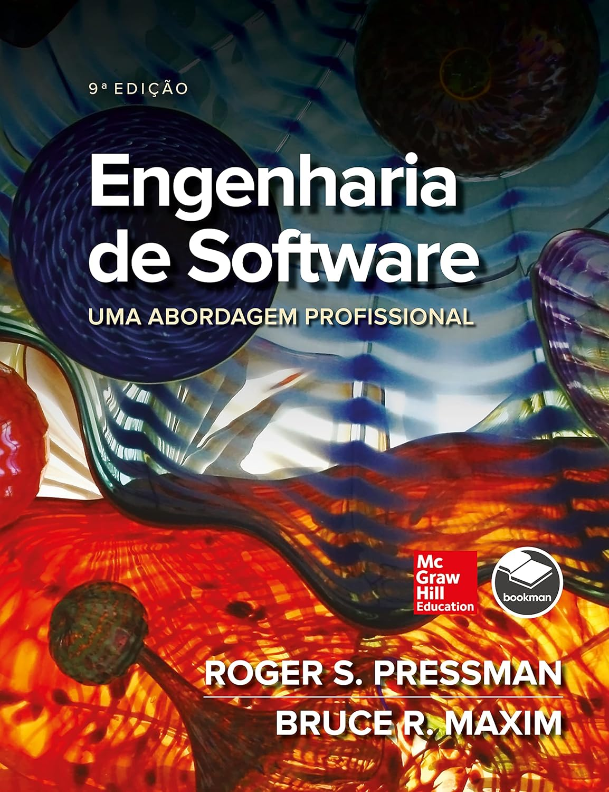 | [Engenharia De Software Uma Abordagem Profissional 9ed](/livros/engenharia_de_software_uma_abordagem_profissional_9ed.pdf) | PRESSMAN, R.; MAXIM, B. |  |
| 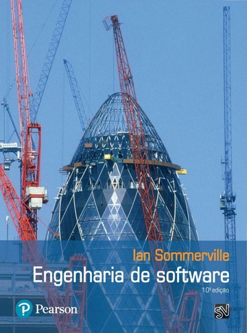 | [Engenharia De Software 10ed](https://drive.google.com/file/d/10O-TZQNQpPRZE4zqR-Ptms57IjjTaidj/view?usp=drive_link) | SOMMERVILLE, I. |  |
| 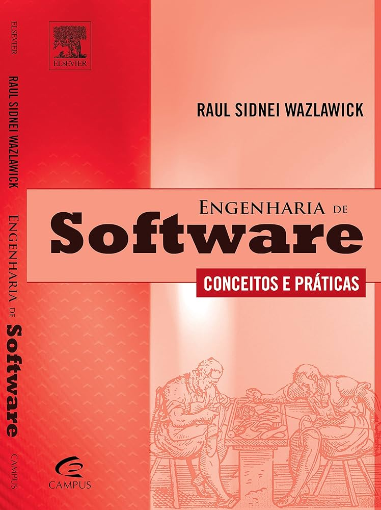 | [Engenharia de software: conceitos e práticas](/livros/) | WAZLAWICK, R. S. |  |
|  | [Guia PMBOK 7ed](/livros/pmbok_7ed.pdf) | PMI |  |
| 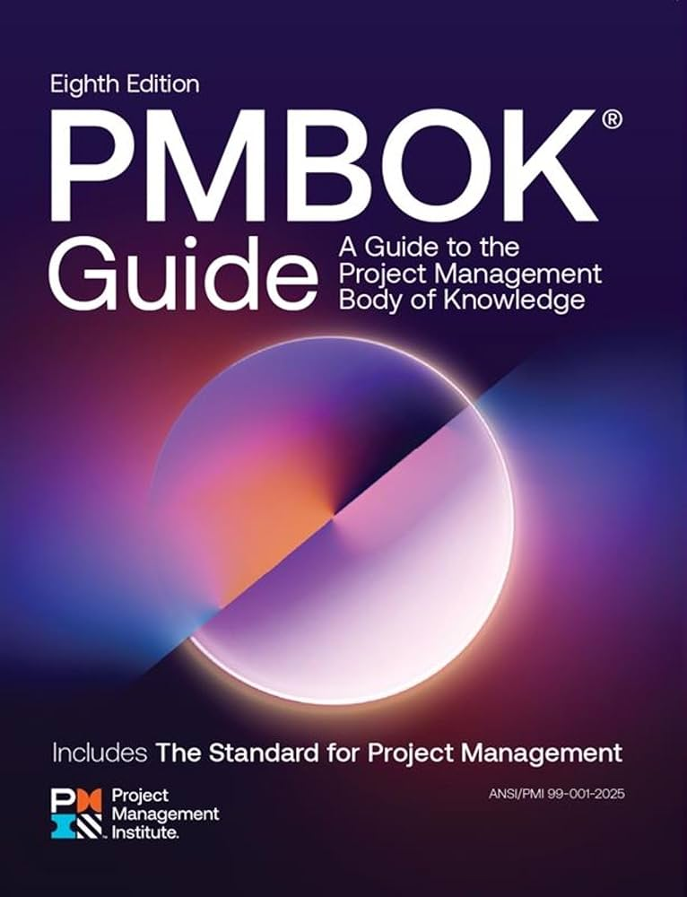 | [PMBOK Guide 8ed](/livros/pmbok_8ed.pdf) | PMI |  |
#
## EQUAÇÕES DIFERENCIAIS ORDINÁRIAS
Equações diferenciais ordinárias de primeira ordem lineares e não lineares. Sistemas lineares de equações diferenciais ordinárias. Equações diferenciais ordinárias de ordem superior. Aplicações.
#
| Livro | Nome da Obra | Autor | Idioma |
|------------|------------|------------|------------|
| 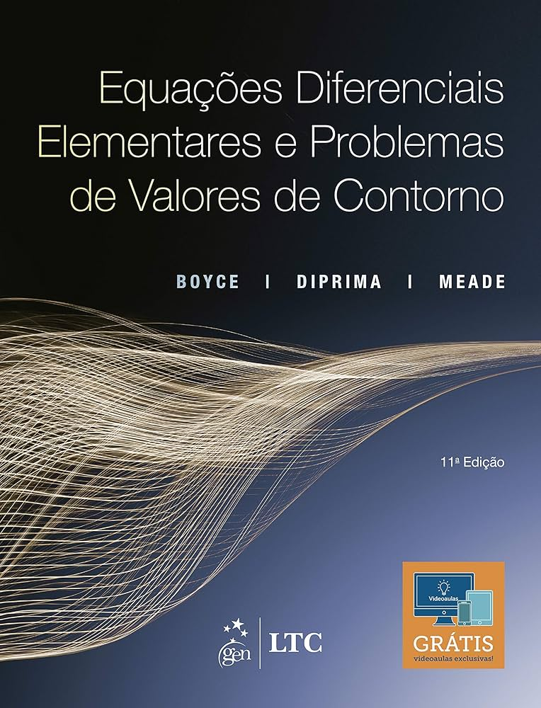 | [Equações diferenciais Elementares e Problemas de Valores de Contorno](/livros/equacoes_diferenciais_elementares_e_problemas_de_valores_de_contorno.pdf) | BOYCE, W. E.; DIPRIMA, R. C. |  |
| 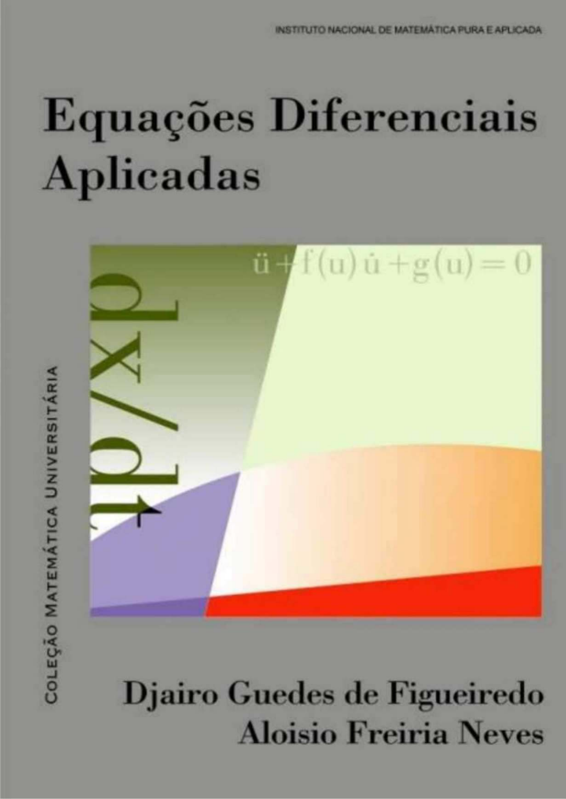 | [Equações Diferenciais Aplicadas](/livros/equacoes_diferenciais_aplicadas.pdf) | DE FIGUEIREDO, D. G.; NEVES, A. |  |
| 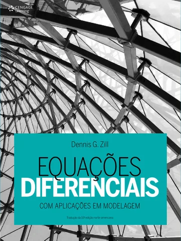 | [Equações Diferenciais com aplicações em modelagem](https://drive.google.com/file/d/1wACSEf1ZK-WOBJskW83fnU-wgIERZgRV/view?usp=drive_link) | ZILL, D. G. |  |
| 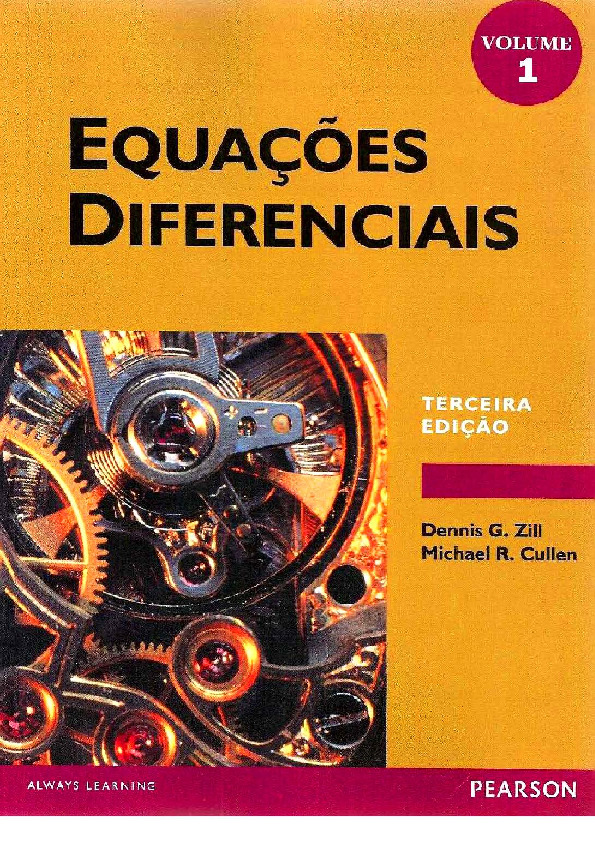 | [Equações Diferenciais V1 3ed](/livros/equações_diferenciais_v1_3ed.pdf) | ZILL, D. G. |  |
| 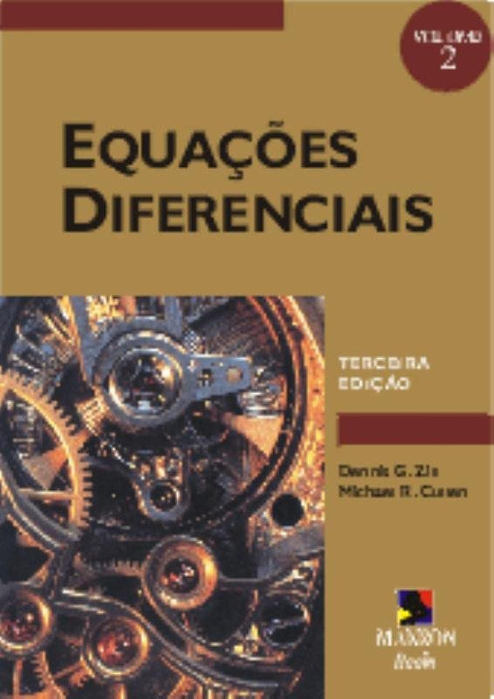 | [Equações Diferenciais V2 3ed](/livros/equações_diferenciais_v2_3ed.pdf) | ZILL, D. G. |  |
#
## FÍSICA I
Introdução à Física. Cinemática e Dinâmica da Partícula. Trabalho e Energia. Gravitação. Sistemas de Partículas. Conservação do Momento Linear. Equilíbrio. Estática, Cinemática e Dinâmica da Rotação de Corpos Rígidos. Conservação do Momento Angular.
#
| Livro | Nome da Obra | Autor | Idioma |
|------------|------------|------------|------------|
|  | [Física I: Mecânica V1 12ed](/livros/fisica_i_mecanica_v1_12ed.pdf) | YOUNG, H. D.; FREEDMAN, R. A. |  |
| 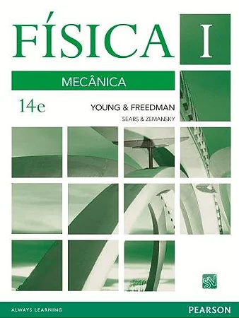 | [Física I: Mecânica V1 14ed](/livros/fisica_i_mecanica_v1_14ed.pdf) | YOUNG, H. D.; FREEDMAN, R. A. |  |
| 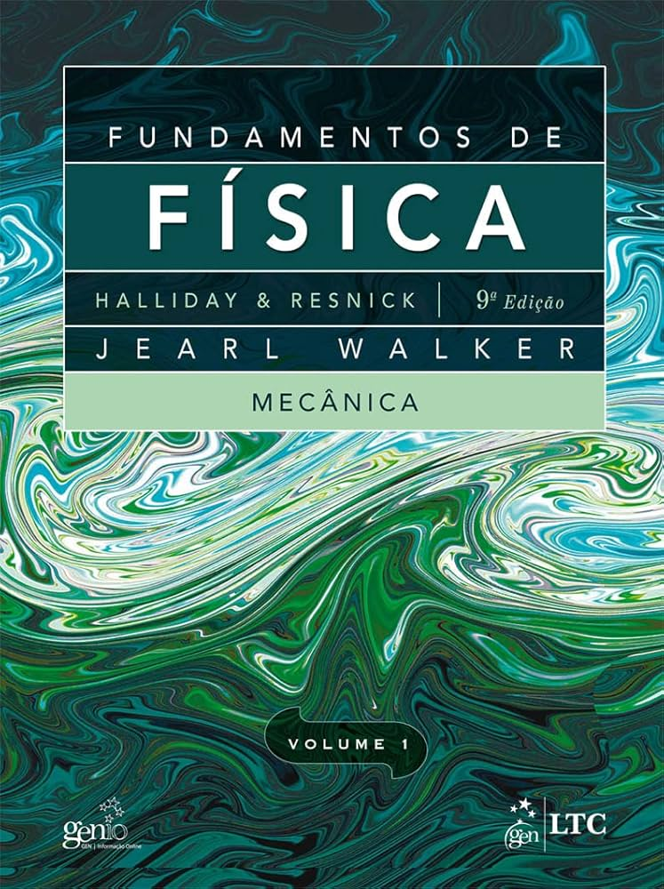 | [Fundamentos de Física: Mecânica V1 9ed](/livros/fundamentos_de_fisica_mecanica_v1_9ed.pdf) | HALLIDAY, D.; RESNICK, R.; WALKER, J.  |  |
| 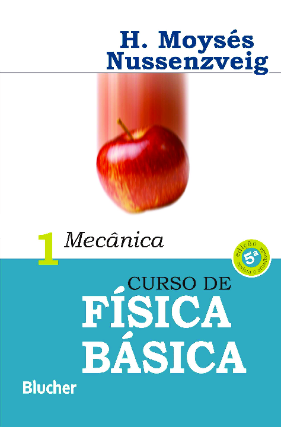 | [Curso de Física Básica: Mecânica V1 4ed](/livros/curso_de_fisica_basica_mecanica_v1_4ed.pdf) | NUSSENZVEIG, H. M. |  |
#
## FÍSICA EXPERIMENTAL I
Introdução à Física Experimental. Noções básicas de estatística descritiva. Noções sobre amostragem. Classificação, estimativa e representação de incertezas. Análise de dados. Experimentos envolvendo fenômenos mecânicos.
#
| Livro | Nome da Obra | Autor | Idioma |
|------------|------------|------------|------------|
| 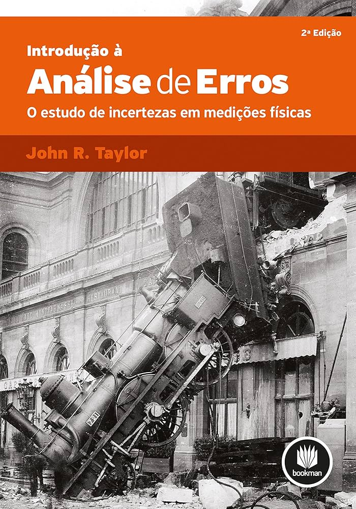 | [Introdução à Análise de Erros: O estudo de incertezas em medições físicas 2ed](/livros/introducao_a_analise_de_erros_o_estudo_de_incertezas_em_medicoes_fisicas_2ed.pdf) | TAYLOR, J. R. |  |
| 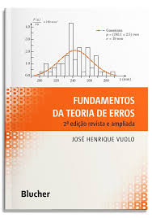 | [Fundamentos da teoria de erros 2ed](/livros/fundamentos-da_teoria_de_erros_2ed.pdf) | VUOLO, J. H. |  |
| 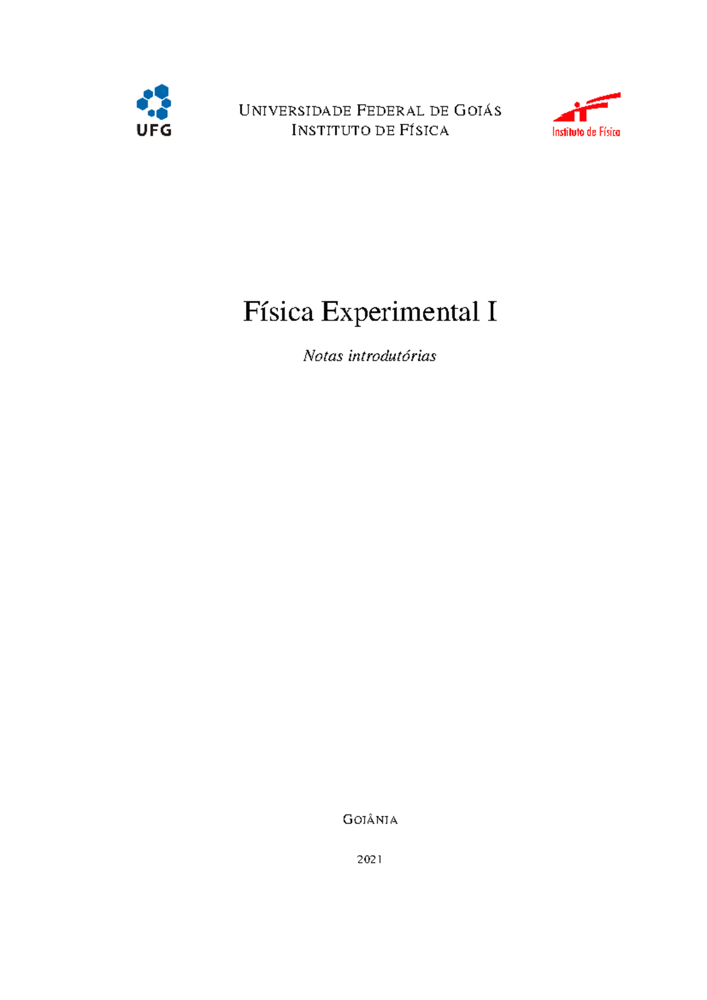 | [Notas Introdutórias - Física Experimental I](/livros/fisica_experimental_i_notas_introdutorias.pdf) |  Instituto de Física - UFG |  |
| 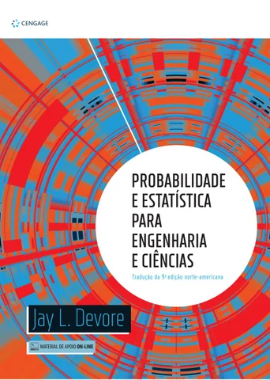 | [Probabilidade e Estatística para Engenharia e Ciências 9ed](https://drive.google.com/file/d/1OdNqajscyaZvn2an1SLtxLA4HPLOQutB/view?usp=drive_link) | WALPOLE, R. E.; MYERS, R. H.; MYERS, S. L.; YE, K. |  |
| 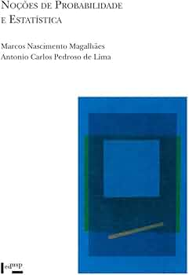 | [Noções de Probabilidade e Estatística 7ed](/livros/nocoes_de_probabilidade_e_estatistica_7ed.pdf) | MAGALHÃES, M. N. |  |
#
## FUNDAMENTOS DE MATEMÁTICA PARA COMPUTAÇÃO
Noções de lógica, Introdução a demonstrações, Indução matemática, Recursividade e Relações de Recorrência, Conjuntos e Combinatória. Séries e sequências. Relações e Funções. Representações numéricas e Mudança de base numérica.
#
| Livro | Nome da Obra | Autor | Idioma |
|------------|------------|------------|------------|
| 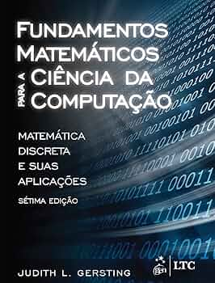 | [Fundamentos Matemáticos para a Ciência da Computação 7ed](/livros/fundamentos_matematicos_para_a_ciencia_da_computacao_7ed.pdf) | GERSTING, J. L. |  |
| 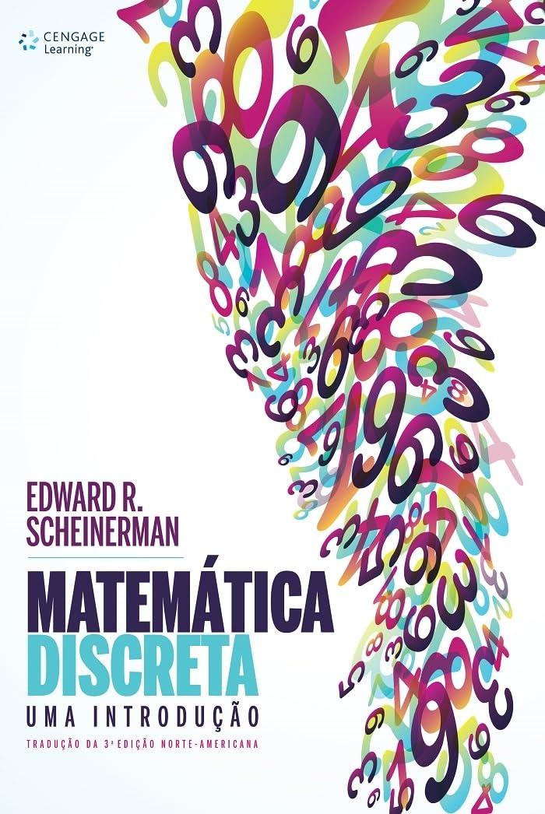 | [Matemática Discreta, Uma introdução 3ed](https://drive.google.com/file/d/1Okn6ZtTOfLGS3smhZbs5eYV73DfQpVhx/view?usp=drive_link) | SCHEINERMAN, E. R. |  |
| 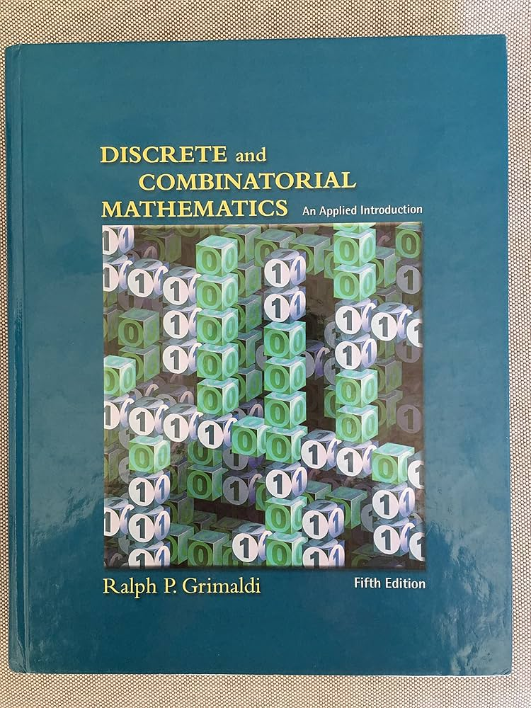 | [Discrete and Combinatorial Mathematics - An Applied Introduction 5ed](/livros/discrete_and_combinatorial_mathematics_an_applied_introduction_5ed.pdf) | GRIMALDI, R. P. |  |
#
## GEOMETRIA ANALÍTICA
Vetores no plano e no espaço: Produto escalar e vetorial; Retas: equações cartesiana e paramétricas; Planos; Cônicas; Superfícies Quádricas; Coordenadas polares.
#
| Livro | Nome da Obra | Autor | Idioma |
|------------|------------|------------|------------|
| 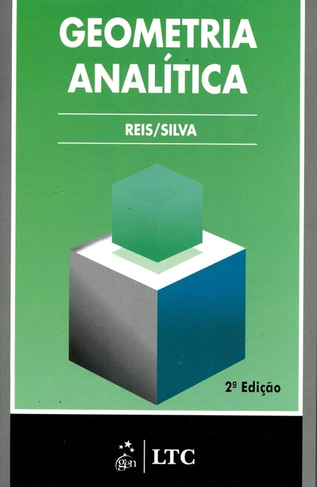 | [Geometria analítica 2ed](/livros/geometria_analitica_2ed.pdf) | REIS, G. L; SILVA, V. V. |  |
| 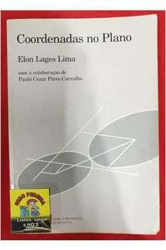 | [Coordenadas no plano 4ed](/livros/coordenadas_no_plano_4ed.pdfr) | LIMA, E. L. |  |
| 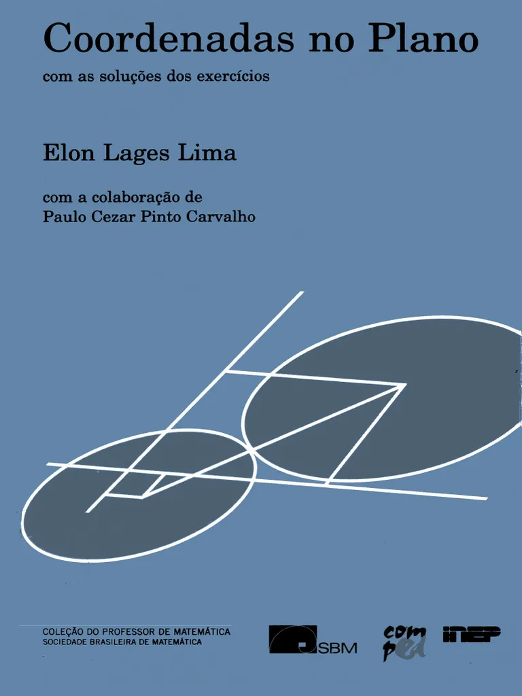 | [Coordenadas no plano 5ed](/livros/coordenadas_no_plano_5ed.pdf) | LIMA, E. L. |  |
#
## INTELIGÊNCIA ARTIFICIAL
Visão geral da Inteligência Artificial e suas aplicações. Representação do conhecimento. Resolução de problemas por meio de buscas. Incerteza. Lógica Fuzzy. Aprendizado de máquina. Aplicações práticas utilizando técnicas de Inteligência Artificial.
#
| Livro | Nome da Obra | Autor | Idioma |
|------------|------------|------------|------------|
| 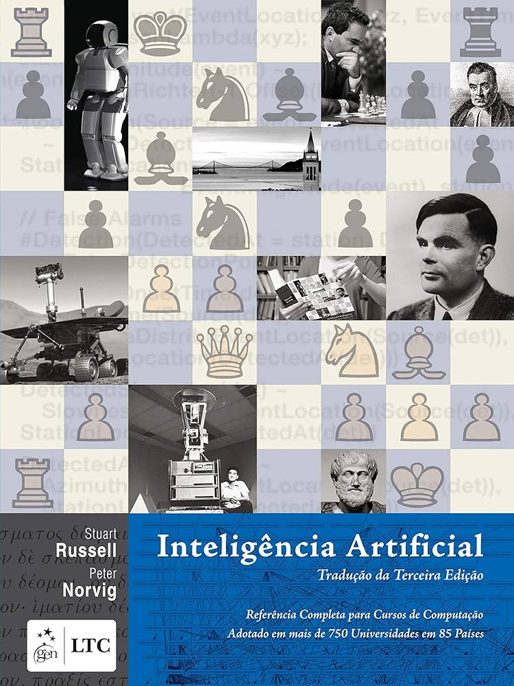 | [Inteligência Artificial 3ed](/livros/inteligencia_artificial_3ed.pdf) | RUSSELL, S; Norvig, P. |  |
| 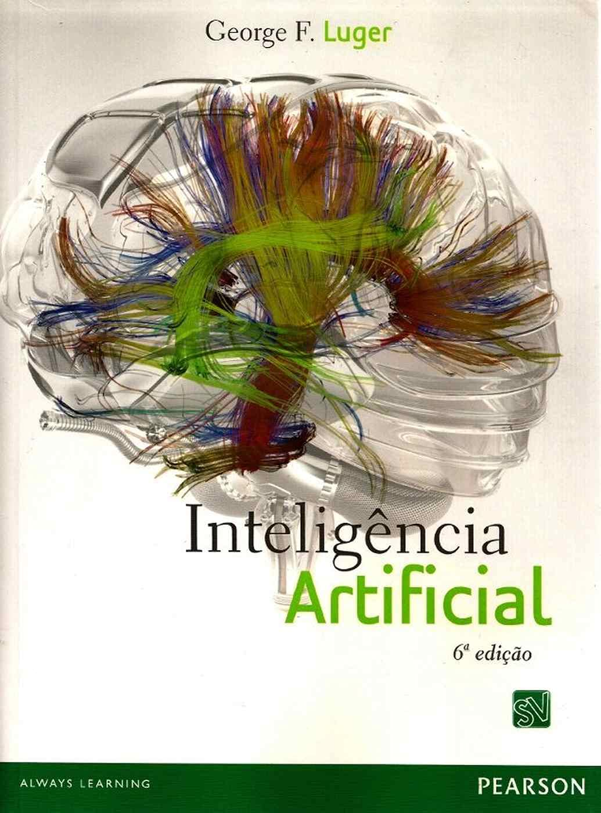 | [Inteligência Artificial 6ed](https://drive.google.com/file/d/1ydIA_8-FvOc2r8IKt6qkDlL3JE1VOPz9/view?usp=drive_link) | LUGER, G. F. |  |
| 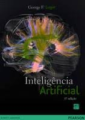 | [Inteligência Artificial 6ed Darkmode](https://drive.google.com/file/d/19YTYc5nXqJCfBuBlmFhSoQQm0_-IUaGf/view?usp=drive_link) | LUGER, G. F. |  |
#
## INTERAÇÃO HUMANO-COMPUTADOR
Aspectos gerais sobre interação humano-computador. Características humanísticas e biológicas, envolvendo questões sobre genealogia, gênero, aspectos étnicos, raciais e culturais, direitos e aspectos políticos, deficiências, limitações e capacidades, dentre outros. Ciclo da interação e principais problemas. Metas de usabilidade e experiência do usuário. Fatores humanos em software interativo: teoria, princípios e regras básicas. Modelos conceituais e metáforas. Estilos de interação. Elementos de interação
(menus, formulários, manipulação direta e outros). Voz, linguagem natural, sons, páginas Web. Padrões para interface. Localização e internacionalização. Princípios de projeto de interfaces humano-computador. Métodos de projeto de interação. Projeto visual (cores, ícones, fontes e outros). Tempo de resposta e retroalimentação. Dispositivos de interação. Métodos de avaliação de interfaces: avaliação heurística, abordagens para testes realizados com apoio de usuários, técnicas de testes para páginas Web, entre outros. Visão geral de ferramentas de desenvolvimento de interfaces humano-computador.
#
| Livro | Nome da Obra | Autor | Idioma |
|------------|------------|------------|------------|
| 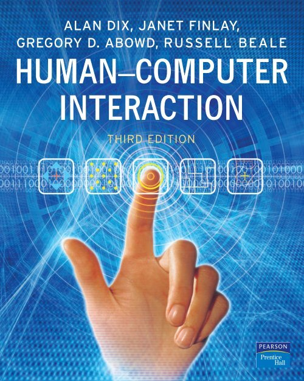 | [Human-Computer Interaction 3ed](/livros/human-computer_interaction_3ed.pdf) | DIX, Alan; FINLAY, J. E.; ABOWD, G. D.; BEALE, R. |  |
| 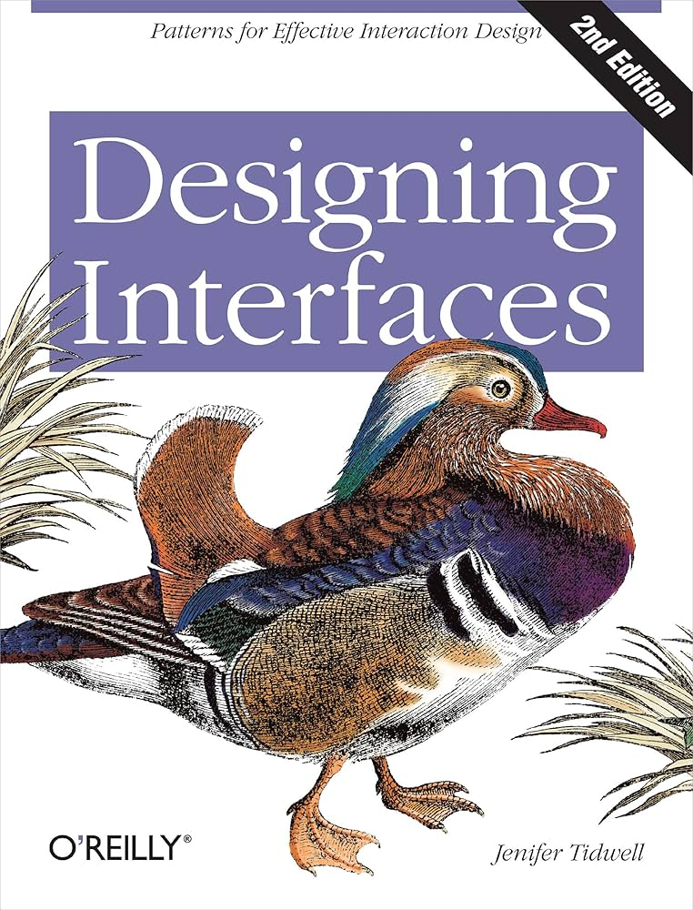 | [Designing Interfaces: Patterns for Effective Interaction Design 2ed](/livros/designing_interfaces_patterns_for_effective_interaction_design_2ed.pdf) | TIDWELL, J. |  |
| 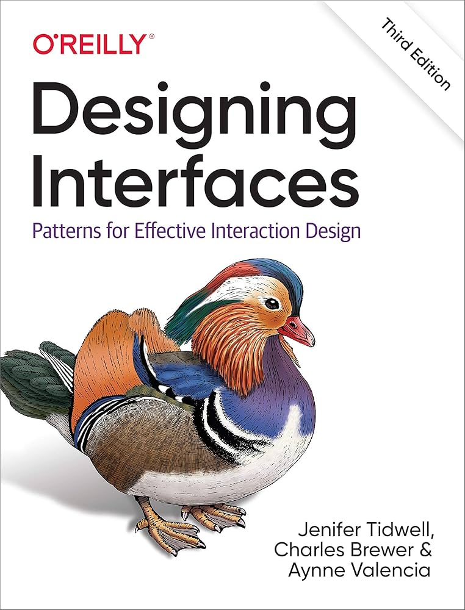 | [Designing Interfaces: Patterns for Effective Interaction Design 3ed](/livros/designing_interfaces_patterns_for_effective_interaction_design_3ed.pdf) | TIDWELL, J. |  |
#
## INTRODUÇÃO À COMPUTABILIDADE E À COMPLEXIDADE COMPUTACIONAL
Noções de computabilidade efetiva. Modelos de computação. Tese de Church-Turing. Decidibilidade. Redutibilidade. Problemas indecidíveis. Complexidade de tempo. Complexidade de Espaço. Teoremas de incompletude de Gödel
#
| Livro | Nome da Obra | Autor | Idioma |
|------------|------------|------------|------------|
| 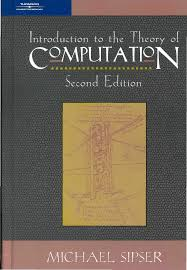 | [Introduction to the theory of computation 2ed](/livros/introduction_to_the_theory_of_computation_2ed.pdf) | SIPSER, M. |  |
| 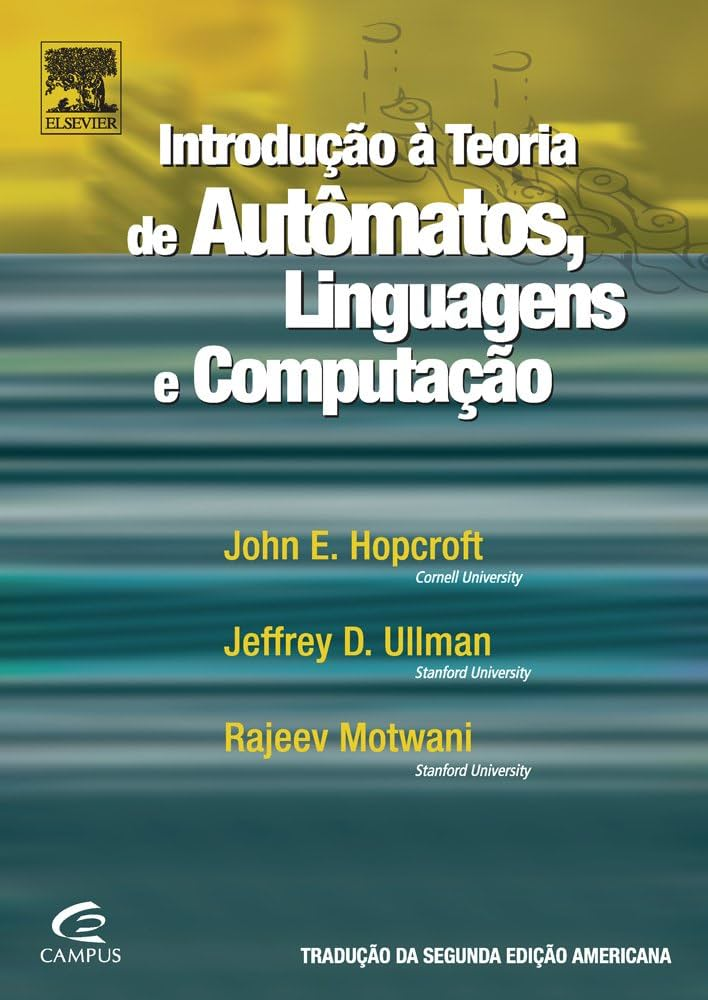 | [Introdução à teoria de autômatos, linguagens e computação 2ed](/livros/introducao_a_teoria_dos_automatos_linguagens_e_computacao_2ed.pdf) | HOPCROFT, J. E.; MOTWANI, R.; ULLMAN, J. |  |
#
## INTRODUÇÃO À PROGRAMAÇÃO
Introdução a algoritmos. Conceitos básicos de programas: constantes; tipos de dados primitivos; variáveis; atribuição; entrada e saída de dados; expressões; estruturas de decisão; estruturas de repetição. Ponteiro. Estruturas de dados homogêneas e heterogêneas: vetores, matrizes, cadeias de caracteres, registros. Subprogramas: funções; passagens de parâmetros por valor e por referência. Manipulação de arquivos: abertura, fechamento, leitura e gravação. Tipos de acesso a arquivos: sequencial e indexado. Tipos de arquivos (texto e binário). Transcrição de algoritmos para uma linguagem de programação. Domínio de uma linguagem de programação: sintaxe e semântica; interpretação e compilação de programas; técnicas de depuração.
#
| Livro | Nome da Obra | Autor | Idioma |
|------------|------------|------------|------------|
| 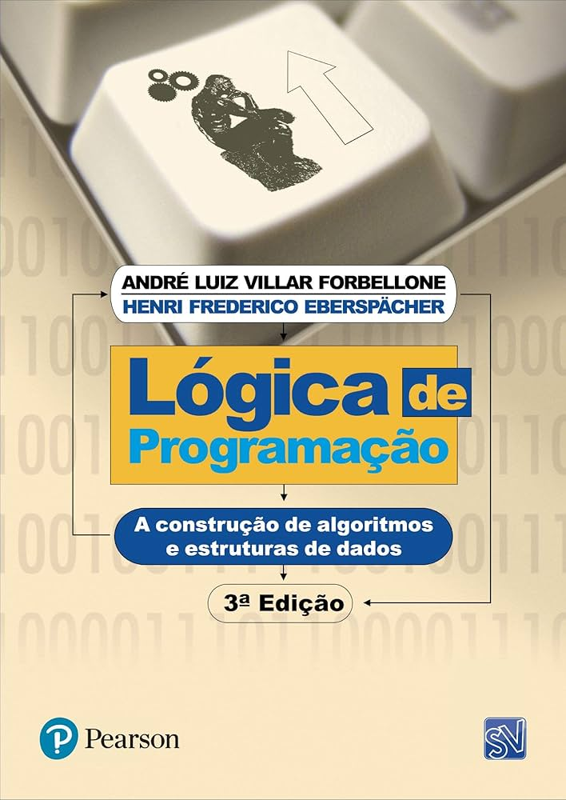 | [Lógica de Programação: A construção de algoritmos e estruturas de dados 3ed](/livros/logica_de_programacao_a_construcao_de_algoritmos_e_estruturas_de_dados_3ed.pdf) | FOBERLONE, A. L. V.; EBERSPACHER, H. F. |  |
| 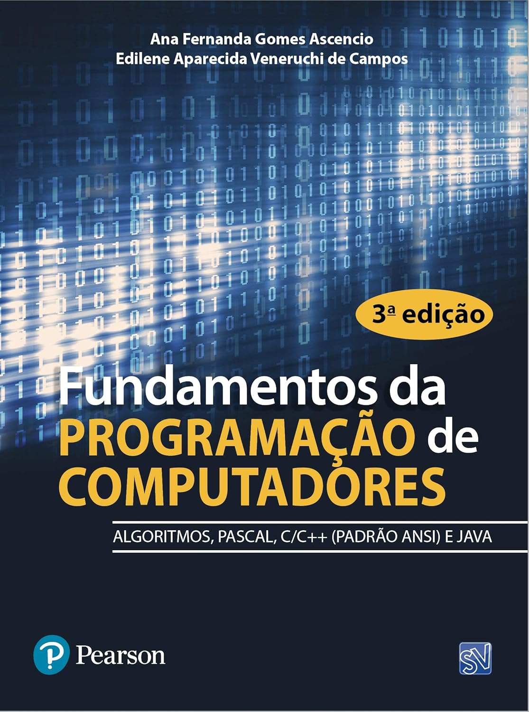 | [Fundamentos da Programação de Computadores 3ed](/livros/fundamentos_da_programacao_de_computadores_3ed.pdf) | ASCENCIO, A. F. G.; CAMPOS C, E. A. V. |  |
| 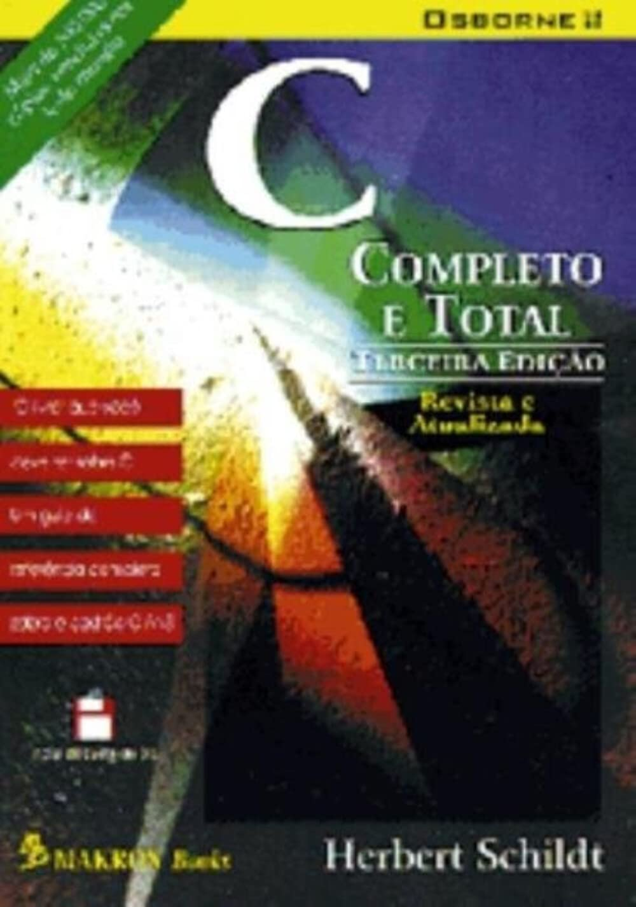 | [C Completo e Total 3ed](/livros/c_completo_e_total_3ed.pdf) | SCHILDT, H. |  |
#
## LINGUAGENS E PARADIGMAS DE PROGRAMAÇÃO
Estudo dos conceitos de linguagens de programação e dos paradigmas de programação: procedural, funcional, lógico, orientado a objeto e script. Reflexão sobre as características desejáveis em uma linguagem de programação e os critérios de seleção de linguagens de acordo com as especificidades dos domínios de aplicação. Descrição de sintaxe e semântica. Estudo sobre tipos de dados, estruturas de controle, ambientes de execução, variáveis, expressões e subprogramas em linguagens de programação.
#
| Livro | Nome da Obra | Autor | Idioma |
|------------|------------|------------|------------|
|  | [Conceitos de Linguagens de Programação 9ed](/livros/conceitos_de_linguagens_de_programacao_9ed.pdf) | SEBESTA, R. W. |  |
| 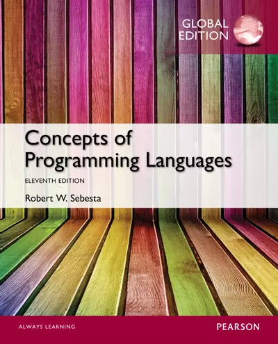 | [Concepts of Programming Languages 11ed](/livros/concepts_of_programming_languages_11ed.pdf) | SEBESTA, R. W. |  |
| 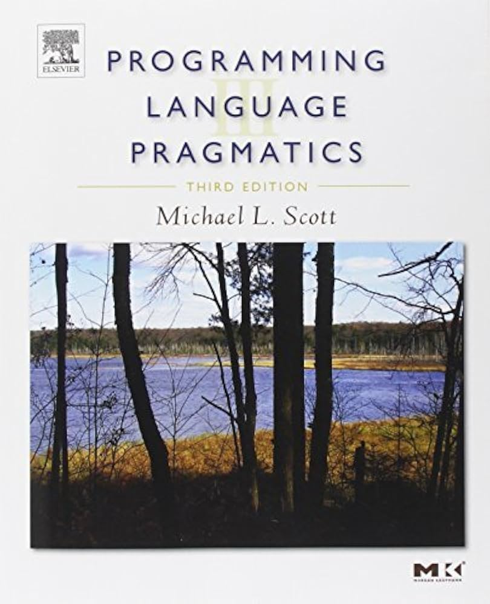 | [Programming Language Pragmatics 3ed](/livros/programming_language_pragmatics_3ed.pdf) | SCOTT, M. L. |  |
| 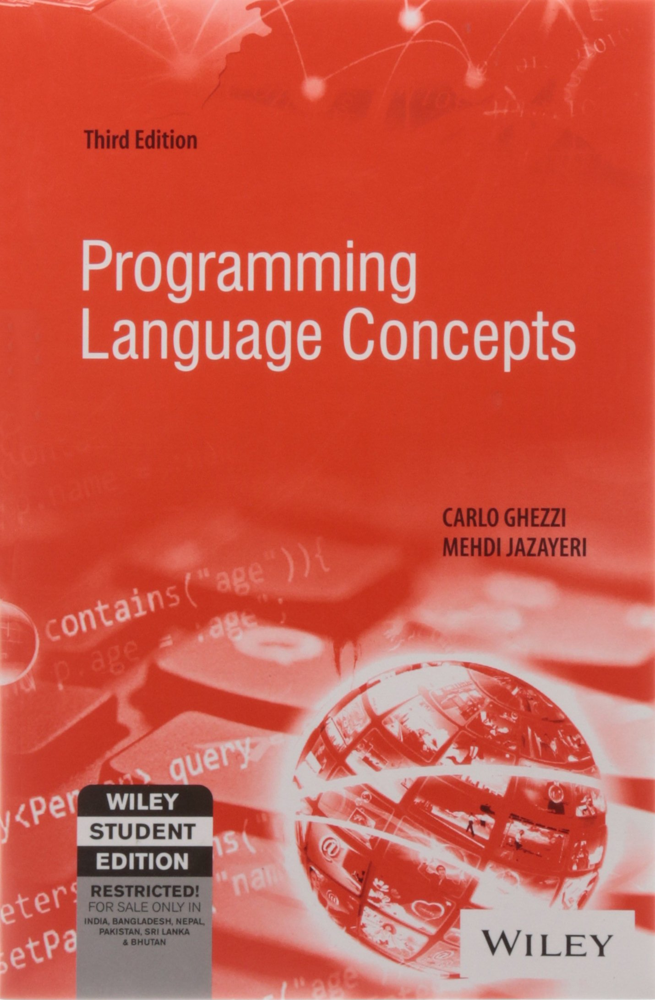 | [Programming Language Concepts 3ed](/livros/programming_language_concepts_3ed.pdf) | GHEZZI, C.; JAZAYERI, M. |  |
#
## LINGUAGENS FORMAIS E AUTÔMATOS
Conceitos básicos de linguagens. Mecanismos geradores (gramáticas) e reconhecedores (determinísticos e não determinísticos) de linguagens regulares, livres de contexto e sensíveis ao contexto; relação entre estas classes de linguagens e suas principais propriedades. Hierarquia de Chomsky.
#
| Livro | Nome da Obra | Autor | Idioma |
|------------|------------|------------|------------|
| 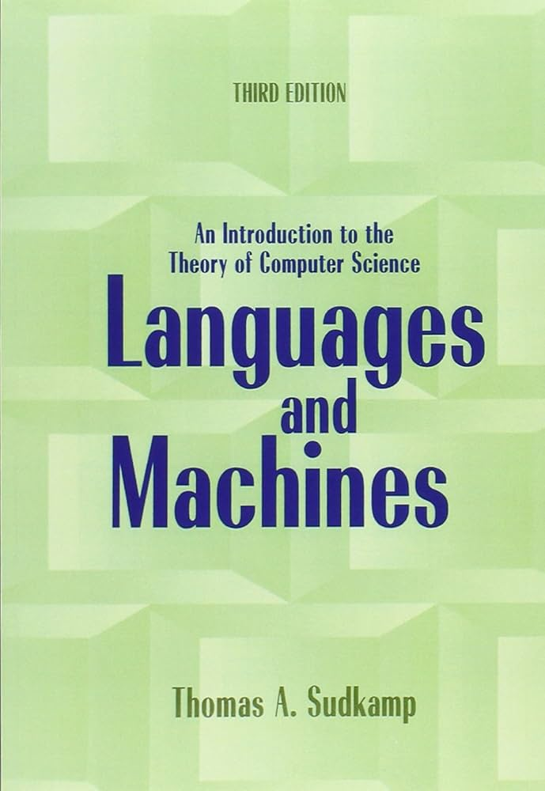 | [Languages and machines 3ed](/livros/languages_and_machines_3ed.pdf) | SUDKAMP, T. A. |  |
|  | [Introduction to the theory of computation 2ed](/livros/introduction_to_the_theory_of_computation_2ed.pdf) | SIPSER, M. |  |
|  | [Introdução à teoria de autômatos, linguagens e computação 2ed](/livros/introducao_a_teoria_dos_automatos_linguagens_e_computacao_2ed.pdf) | HOPCROFT, J. E.; MOTWANI, R.; ULLMAN, J. |  |
#
## LÓGICA MATEMÁTICA
Lógica Proposicional e de Predicados. Sistemas Dedutivos. Relações de Consequência. Correção e Completamento. Aplicações em Computação.
#
| Livro | Nome da Obra | Autor | Idioma |
|------------|------------|------------|------------|
| 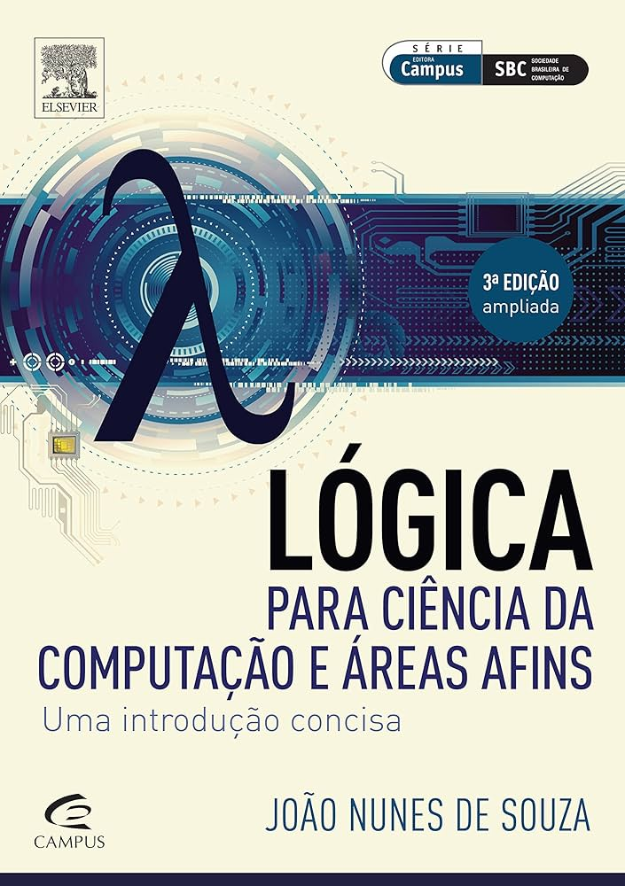 | [Lógica para Ciência da Computação 3ed](/livros/logica_para_ciencia_da_computacao_3ed.pdf) | SOUZA, J. N. |  |
| 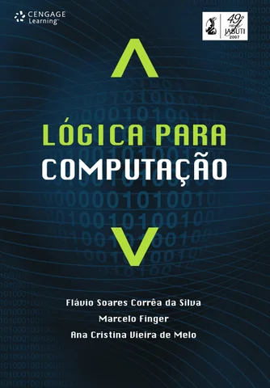 | [Lógica para Computação](/livros/logica_para_computacao.pdf) | SILVA, F. C.; FINGER, M.; MELO, A. C. V. |  |
#
## MATEMÁTICA DISCRETA
Conjuntos: finito, infinito, enumerável, cardinalidade. Técnica de diagonalização. Tópicos em teoria dos números. Estruturas algébricas e criptografia.
#
| Livro | Nome da Obra | Autor | Idioma |
|------------|------------|------------|------------|
| 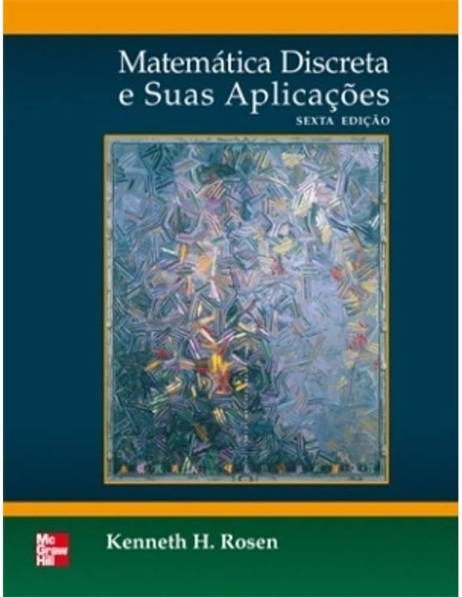 | [Matemática Discreta e Suas Aplicações 6ed](https://drive.google.com/file/d/1Okn6ZtTOfLGS3smhZbs5eYV73DfQpVhx/view?usp=drive_link) | ROSEN, K. H. |  |
| 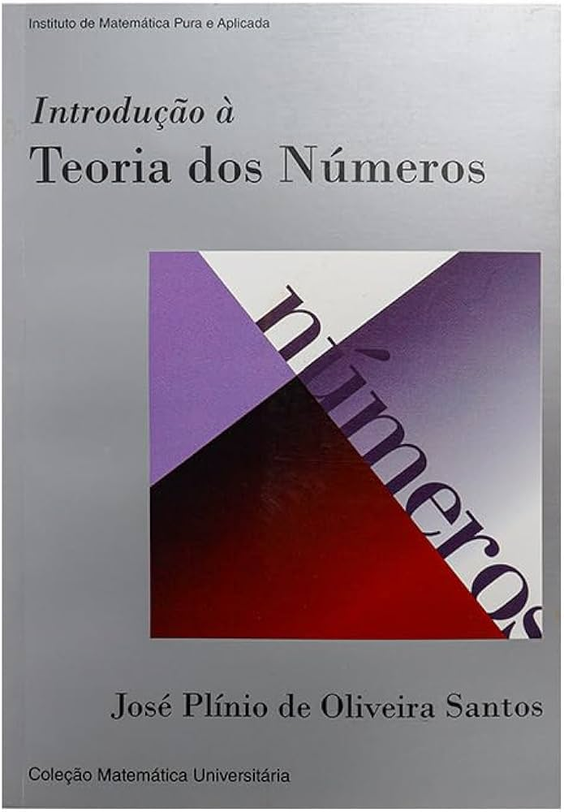 | [Introdução à Teoria dos Números](/livros/introducao_a_teoria_dos_numeros.pdf) | SANTOS, J. P. D. O. |  |
| 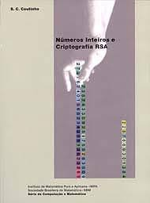 | [Números Inteiros e Criptografia RSA 2ed](/livros/numeros_inteiros_e_criptografia_rsa_2ed.pdf) | COUTINHO, S. C. |  |
#
## METODOLOGIA DE PESQUISA EM COMPUTAÇÃO
Estilos de pesquisa em Computação. Preparação de um trabalho de pesquisa. Escrita do trabalho científico. Apresentação oral do trabalho científico. Apresentação de programas de Iniciação Científica.
#
| Livro | Nome da Obra | Autor | Idioma |
|------------|------------|------------|------------|
| 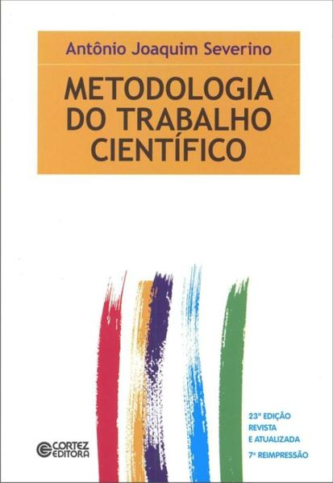 | [Metodologia do Trabalho Científico 23ed](./livros/metodologia_do_trabalho_científico_23ed.pdf) | SEVERINO, A. J. |  |
| 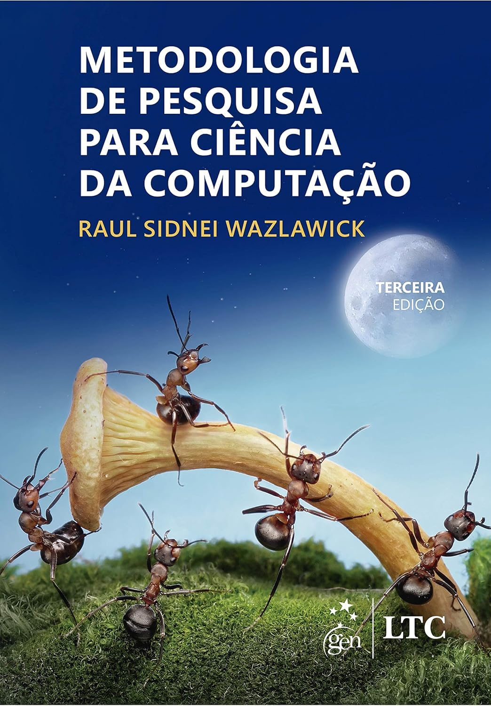 | [Metodologia de Pesquisa para Ciência da Computação 3ed](./livros/metodologia_de_pesquisa_para_ciencia_da_computacao_3ed.pdf) | WAZLAWICK, R. S. |  |
#
## PESQUISA OPERACIONAL
Modelagem. Problema de Programação Linear (PL). Resolução gráfica de PL. Algoritmo Simplex. Dualidade. Algoritmo Simplex-Dual. Pós-otimização e Análise de Sensibilidade.
#
| Livro | Nome da Obra | Autor | Idioma |
|------------|------------|------------|------------|
| 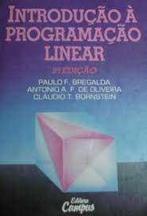 | [Introdução à Programação Linear 3ed](./livros/introducao_a_programacao_linear_3ed.pdf) | BREGALDA, P. F.; OLIVEIRA, A. A. F. |  |
| 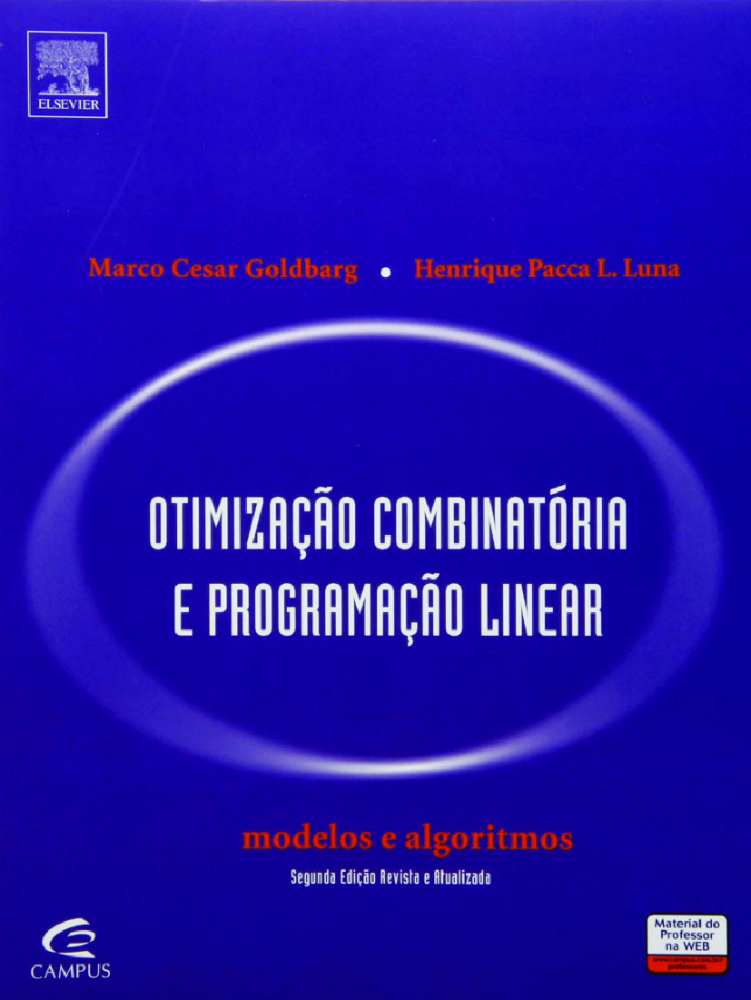 | [Otimização Combinatória e Programação Linear 2ed](./livros/otimizacao_combinatoria_e_programacao_linear_2ed.pdf) | GOLBARG, M.; LUNA, H. |  |
| 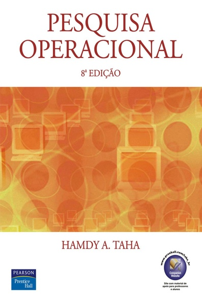 | [Pesquisa Operacional 8ed](https://drive.google.com/file/d/11vyW94-i_Jwa68zuU5w-FkypMIiVoQxB/view?usp=drive_link) | TAHA, H. |  |
#
## PROBABILIDADE E ESTATÍSTICA A
Estatística descritiva. Noções sobre amostragem. Introdução à teoria de conjuntos. Introdução à teoria de probabilidade: espaço amostral, eventos, frequência relativa, fundamentos de probabilidade, probabilidade condicional, eventos independentes e teorema de Bayes. Variáveis aleatórias: conceitos básicos, esperança e variância. Distribuições discretas de probabilidade: uniforme, binomial e Poisson. Distribuições contínuas de probabilidade: uniforme, exponencial, normal e t-Student. Estimação pontual e intervalar para uma população: média e proporção. Teste de hipóteses para uma população: média e proporção. Correlação linear e regressão linear simples.
#
| Livro | Nome da Obra | Autor | Idioma |
|------------|------------|------------|------------|
|  | [Probabilidade e Estatística para Engenharia e Ciências 9ed](https://drive.google.com/file/d/1OdNqajscyaZvn2an1SLtxLA4HPLOQutB/view?usp=drive_link) | WALPOLE, R. E.; MYERS, R. H.; MYERS, S. L.; YE, K. |  |
|  | [Noções de Probabilidade e Estatística 7ed](/livros/nocoes_de_probabilidade_e_estatistica_7ed.pdf) | MAGALHÃES, M. N. |  |
| 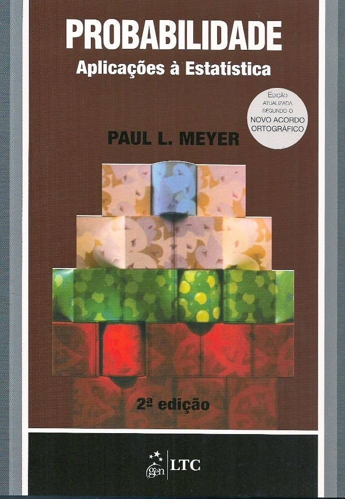 | [Probabilidade: Aplicações à Estatística 2ed](/livros/probabilidade_aplicaoes_a_estatistica_2ed.pdf) | MEYER, P. L. |  |
#
## PROGRAMAÇÃO ORIENTADA A OBJETOS
Abstração e tipos abstratos de dados. Classes, métodos, encapsulamento, interface. Mensagens, instâncias e inicialização. Herança e composição. Polimorfismo. Uso de uma linguagem orientada a objetos. Noções de UML. Noções de padrões de projeto orientado a objetos.
#
| Livro | Nome da Obra | Autor | Idioma |
|------------|------------|------------|------------|
| 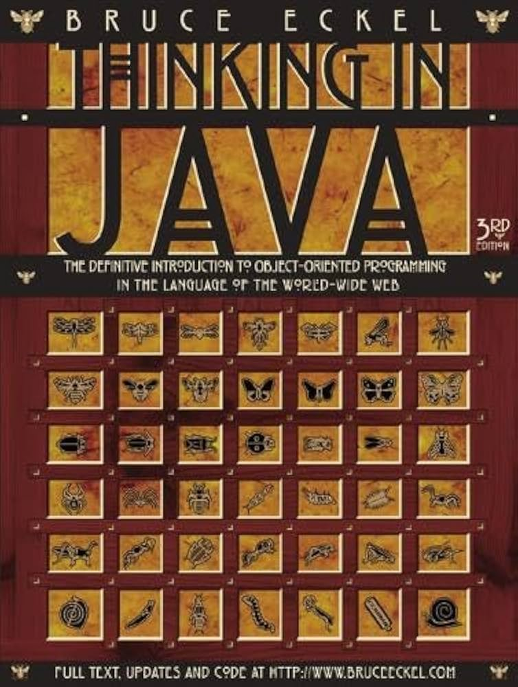 | [Pensando em Java 3ed](https://ww2.inf.ufg.br/~marceloakira/intro-prog/docs/tij/tij2pej/PEJ3.htm) | ECKEL, B. |  |
| 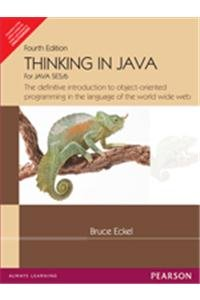 | [Thinking in Java 4ed](./livros/thinking_in_java_4ed.pdf) | ECKEL, B. |  |
| 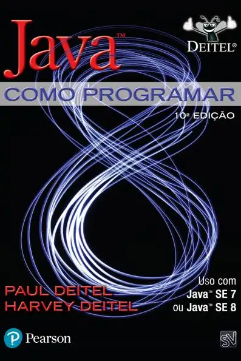 | [Java como programar 10ed](./livros/java_como_programar_10ed.pdf) | DEITEL, P. J; DEITEL, H. M. |  |
