# Estrutura Curricular

## Disciplinas de natureza obrigatória

| Sigla | Nome da Disciplina | Requisitos | Núcleo |
|------------|------------|------------|------------|
| IME-AL | [Álgebra Linear](#álgebra-linear) |  | NC |
| INF-AED1 | [Algoritmos e Estruturas de Dados 1](#algoritmos-e-estruturas-de-dados-1) | [INF-IP]() | NC |
| INF-AED2 | [Algoritmos e Estruturas de Dados 2](#algoritmos-e-estruturas-de-dados-2) | [INF-AED1](#algoritmos-e-estruturas-de-dados-1) | NC |
| INF-APA | [Análise e Projeto de Algoritmos](#análise-e-projeto-de-algoritmos) | [INF-AED2](#algoritmos-e-estruturas-de-dados-2) | NC |
| INF-ARQ | [Arquitetura de Computadores](#arquitetura-de-computadores) |  | NC  |
| INF-BD | [Banco de Dados](#banco-de-dados) |  | NC |
| IME-C1A | [Cálculo 1A](#cálculo-1a) |  | NC |
| IME-C2A | [Cálculo 2A]() | [IME-C1A](#cálculo-1a) (co) | NE |
| IME-CN | [Cálculo Numérico]() | [IME-EDO]() | NE |
| EMC-CD | [Circuitos Digitais]() |  | NE |
| INF-COMP | [Compiladores]() | [INF-LFA]() | NE |
| INF-CS | [Computação e Sociedade](#computação-e-sociedade) |  | NC |
| INF-CG | [Computação Gráfica]() | [IME-GA](); [IME-AL](#álgebra-linear) | NE  |
| INF-CP | [Computação Paralela]() |  | NE |
| INF-ES | [Engenharia de Software]() |  | NC |
| IME-EDO | [Equações Diferenciais Ordinárias]() | [IME-C2A]() | NE |
| IF-FE1 | [Física Experimental I]() | [IF-F1]() (co) | NE |
| IF-F1 | [Física I]() | [IME-C1A](#cálculo-1a) (co) | NE |
| INF-FMC | [Fundamentos de Matemática para Computação]() |  | NC |
| IME-GA | [Geometria Analítica]() |  | NE |
| INF-IA | [Inteligência Artificial]() | [IME-PEA]() | NE |
| INF-IHC | [Interação Humano-Computador]() |  | NC |
| INF-ICCC | [Introdução à Computabilidade e à Complexidade Computacional]() | [INF-LFA](); [INF-APA](#análise-e-projeto-de-algoritmos) | NE |
| INF-IP | [Introdução à Programação]() |  | NC |
| INF-LPP | [Linguagens e Paradigmas de Programação]() |  | NC |
| INF-LFA | [Linguagens Formais e Autômatos]() | [INF-FMC]() | NE |
| INF-LM | [Lógica Matemática]() | [INF-MD]() | NC |
| INF-MD | [Matemática Discreta]() | [INF-FMC]() | NE |
| INF-MPC | [Metodologia de Pesquisa em Computação]() |  | NE |
| INF-PO | [Pesquisa Operacional]() | [IME-AL]() | NE |
| IME-PEA | [Probabilidade e Estatística A]() | [IME-C1A](#cálculo-1a) | NC |
| INF-POO | [Programação Orientada a Objetos]() | [INF-IP]() | NC |
| INF-PFC1 | [Projeto Final de Curso 1]() |  | NE |
| INF-PFC2 | [Projeto Final de Curso 2]() |  | NE |
| INF-RC | [Redes de Computadores 1]() |  | NE |
| INF-SD | [Sistemas Distribuídos]() |  | NE |
| INF-SO | [Sistemas Operacionais]() |  | NE |
| INF-SB | [Software Básico]() | [INF-ARQ](#arquitetura-de-computadores) | NE |
| INF-TG | [Teoria dos Grafos]() | [INF-MD]() | NE |
#

## Disciplinas de natureza optativa

| Sigla | Nome da Disciplina | Requisitos | Núcleo |
|------------|------------|------------|------------|
| INF-AA | [Algoritmos de Aproximação]() | [INF-APA]() | NE |
| INF-AG | [Algoritmos em Grafos]() | [INF-TG]() | NE |
| INF-AMC | [Aplicações de Microcontroladores]() | [INF-MICRO]() | NE |
| INF-AM | [Aprendizado de Máquina]() |  | NE |
| INF-AMNS | [Aprendizado de Máquina Não Supervisionado]() | [INF-IA]() | NE |
| INF-AMS | [Aprendizado de Máquina Supervisionado]() | [INF-IA]() | NE |
| INF-APR | [Aprendizado de Máquina por Reforço]() |  | NE |
| INF-AD | [Armazém de Dados]() |  | NE |
| INF-AS | [Arquitetura de Software]() |  | NE |
| INF-ADSC | [Avaliação de Desempenho de Sistemas Computacionais]() |  | NE |
| INF-BDD | [Banco de Dados Distribuídos]() |  | NE |
| INF-CC | [Classes de Grafos]() | [INF-TG]() | NE |
| INF-CPAR | [Complexidade Parametrizad]() | [INF-ICCC]() | NE |
| INF-CAD | [Computação de Alto Desempenho]() |  | NE |
| INF-CE | [Computação Evolucionária]() |  | NE |
| INF-CMU | [Computação Móvel e Ubíqua]() |  | NE |
| INF-CVERDE | [Computação Verde]() |  | NE |
| INF-DSW | [Desenvolvimento de Sistemas para Web]() |  | NE |
| INF-DSDM | [Desenvolvimento de Software Dirigido por Modelos]() |  | NE |
| INF-ELET | [Eletrônica para Computação]() |  | NE |
| INF-ED | [Empreendedorismo Digital]() | [INF-IAE]() | NE |
| INF-ESIS | [Engenharia de Sistemas]() |  | NE |
| INF-ESI1 | [Engenharia de Sistemas de Informação 1]() |  | NE |
| INF-ESI2 | [Engenharia de Sistemas de Informação 2]() | [INF-ESI1]() | NE |
| INF-ESBB | [Engenharia de Software Baseada em Busca]() |  | NE |
| IF-F3 | [Física 3]() | [IF-F1]() | NE |
| IF-FE3 | [Física Experimental 3]() | [IF-FE1]() | NE |
| INF-FR | [Fluxos em Redes]() | [INF-TG](); [INF-PO]() | NE |
| INF-FOTO | [Fotogrametria]() |  | NE |
| INF-FLP | [Fundamentos de Linguagem de Programação]() | [INF-LC]() | NE |
| INF-GPS | [Gerência de Projeto de Software]() |  | NE |
| INF-GPSSI | [Gerenciamento de Processos e Serviços em SI]() | [INF-IAE]() | NE |
| INF-GSI | [Gestão de Segurança da Informação]() | [INF-RC]() | NE |
| INF-GSTI | [Gestão de Sistemas de TI]() | [INF-IAE]() | NE |
| INF-GCTI | [Governança Corporativa e de TI]() | [INF-IAE]() | NE |
| INF-HMM | [Heurísticas e Modelagem Multiobjetivo]() |  | NE |
| INF-IIS | [Implementação e Integração de Software]() | [INF-PS]() | NE |
| INF-IVC | [Infraestruturas Virtualizadas de Computação]() |  | NE |
| INF-ID | [Integração de Dados]() |  | NE |
| INF-IOT | [Internet das Coisas]() |  | NE |
| INF-IAE | [Introdução à Administração de Empresas]() |  | NE |
| IF-ICQ | [Introdução à Computação Quântica]() | [IME-AL]() | NE |
| FL-ILBS | [Introdução à Língua Brasileira de Sinais]() |  | NE |
| INF-IRM | [Introdução à Robótica Móvel]() |  | NE |
| INF-ITP | [Introdução à Teoria das Provas]() |  | NE |
| INF-ITT | [Introdução à Teoria dos Tipos]() |  | NE |
| INF-ISI | [Introdução aos Sistemas de Informação]() |  | NE |
| INF-JD | [Jogos Digitais]() |  | NE |
| INF-LC | [Lógica em Computação]() | [INF-LM](); [INF-PF]() | NE |
| INF-MES | [Mercado e Economia de Software]() |  | NE |
| INF-MH | [Meta-heurísticas]() |  | NE |
| INF-MEES | [Metodologia e Experimentação em Engenharia de Software]() |  | NE |
| INF-MICRO | [Microcontroladores]() | [EMC-CD]() | NE |
| INF-MSD | [Middleware para Sistemas Distribuídos]() |  | NE |
| INF-MDADOS | [Mineração de Dados]() |  | NE |
| INF-MC | [Modelos de Concorrência]() | [INF-LC]() | NE |
| INF-PAR | [Percepção e Ação Robótica]() | [INF-VC]() | NE |
| INF-PDM | [Processamento de Dados Massivo]() |  | NE |
| INF-PLN | [Processamento de Linguagem Natural]() |  | NE |
| INF-PDI  | [Processamento Digital de Imagens]() |  | NE |
| INF-PDSI | [Processamento Digital de Sinais e Imagens]() |  | NE |
| INF-PC | [Programação Concorrente]() |  | NE |
| INF-PF | [Programação Funcional]() | [INF-LC]() | NE |
| INF-PL | [Programação Linear]() |  | NE |
| INF-PS  | [Projeto de Software]() | [INF-POO]() | NE |
| INF-PI1 | [Projeto Integrador 1]() |  | NE |
| INF-PI2  | [Projeto Integrador 2]() |  | NE |
| INF-RI  | [Recuperação de Informação]() |  | NE |
| INF-RC2 | [Redes de Computadores 2]() |  | NE |
| INF-RNA | [Redes Neurais Artificiais]() |  | NE |
| INF-RNP | [Redes Neurais Profundas]() |  | NE |
| INF-RSF | [Redes sem Fio]() |  | NE |
| INF-RS | [Requisitos de Software]() |  | NE |
| INF-SAS | [Segurança e Auditoria de Sistemas]() |  | NE |
| INF-SE | [Sistemas Embarcados]() |  | NE |
| INF-SGBD | [Sistemas Gerenciadores de Banco de Dados]() |  | NE |
| INF-SM | [Sistemas Multiagentes]() |  | NE |
| INF-SDM | [Software para Dispositivos Móveis]() | [INF-PS]() | NE |
| INF-SPD | [Software para Persistência de Dados]() | [INF-SGBD]() | NE |
| INF-SSU | [Software para Sistemas Ubíquos]() | [INF-IIS]() | NE |
| INF-TG2 | [Teoria dos Grafos II]() | [INF-TG]() | NE |
| INF-TS | [Teste de Software]() |  | NE |
| INF-TARSF | [Tópicos Avançados em Redes Sem Fio]() |  | NE |
| INF-TSI | [Tópicos Avançados em Sistemas de Informação 1]() |  | NE |
| INF-TC | [Tópicos em Computação]() |  | NE |
| INF-TCF | [Tópicos em Computação Física]() |  | NE |
| INF-TCV | [Tópicos em Computação Visual]() |  | NE |
| INF-TES | [Tópicos em Engenharia de Software]() |  | NE |
| INF-TBD | [Tópicos em Gerência de Dados]() |  | NE |
| INF-TIA  | [Tópicos em Inteligência Artificial]() |  | NE |
| INF-TLSC | [Tópicos em Lógica e Semântica de Computação]() | [INF-PF]() | NE |
| INF-TSC | [Tópicos em Sistemas de Computação]() |  | NE |
| INF-TTS | [Tópicos em Teste de Software]() |  | NE |
| INF-TECC | [Tópicos Especiais em Complexidade da Computação]() | [INF-APA](); [INF-ICCC]() | NE |
| INF-VFP  | [Verificação Formal de Programas]() | [INF-LC]() | NE |
| INF-VC | [Visão Computacional]() | [INF-PDI]() | NE |
| INF-VR | [Visão Robótica]() |  | NE |
| INF-VI | [Visualização de Informações]() |  | NE |
| INF-WS  | [Web Semântica]() |  | NE |
#
# Ementas e Bibliografias dos Componentes Curriculares

## ÁLGEBRA LINEAR
Sistemas lineares e matrizes. Espaços vetoriais. Transformações lineares. Autovalores e autovetores. Espaços com produto interno.
#
| Livro | Nome da Obra | Autor | Idioma |
|------------|------------|------------|------------|
| 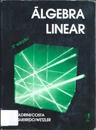 | [Álgebra Linear 3ed](./livros/Algebra_Linear_3ed.pdf) | BOLDRINI, J. L.; COSTA, S. I. R; FIGUEIREDO, V. L; WETZLER, H. G. |  |
|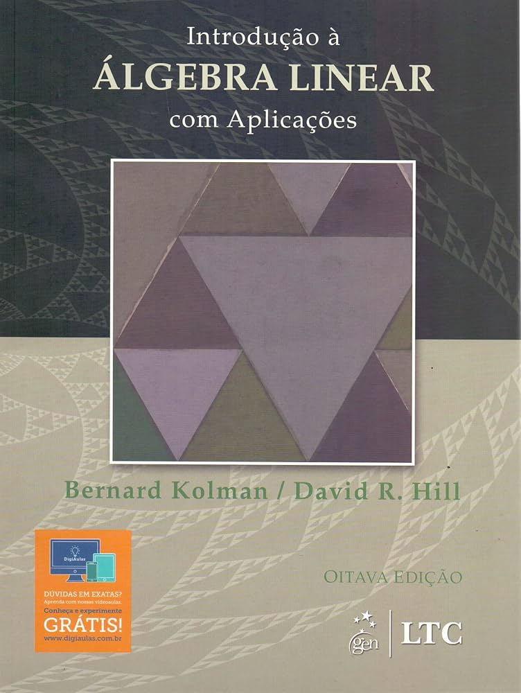 | [Introdução à álgebra linear: com aplicações 8ed](./livros/algebra_linear_com_aplicacoes_8ed.pdf) | KOLMAN, B.; HILL, D. R. |  |
| 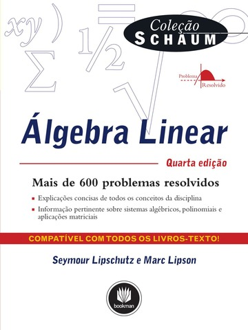 | [Álgebra linear 4ed](./livros/algebra_linear_4ed.pdf) | LIPSCHUTZ, S. |  |
| 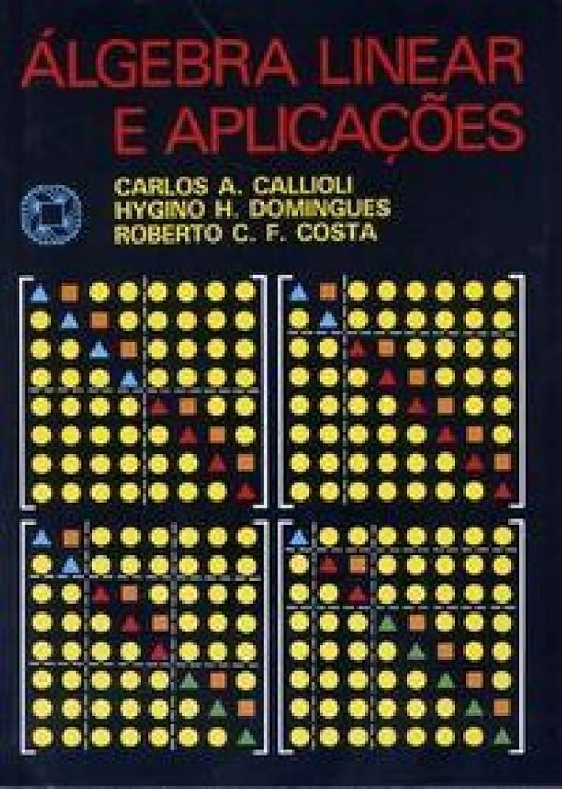 | [Álgebra linear e aplicações 6ed](./livros/algebra_linear_e_aplicacoes_6ed.pdf) | CALLIOLI, C. A.; DOMINGUES, H. H.; COSTA, R. C. F. |  |
| 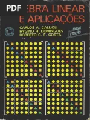 | [Álgebra linear e aplicações 9ed](./livros/algebra_linear_e_aplicacoes_9ed.pdf) | CALLIOLI, C. A.; DOMINGUES, H. H.; COSTA, R. C. F. |  |
#
## ALGORITMOS E ESTRUTURAS DE DADOS 1
Noções de complexidade de algoritmos (notações de complexidade). Recursividade. Algoritmos de pesquisa: pesquisa sequencial e binária. Algoritmos de ordenação. Tipos abstratos de dados. Estruturas de dados utilizando vetores: pilhas, filas, listas (simples e circulares). Estruturas de dados com alocação dinâmica de memória: pilhas, filas, listas (simplesmente encadeadas, duplamente encadeadas e circulares).
#
| Livro | Nome da Obra | Autor | Idioma |
|------------|------------|------------|------------|
| 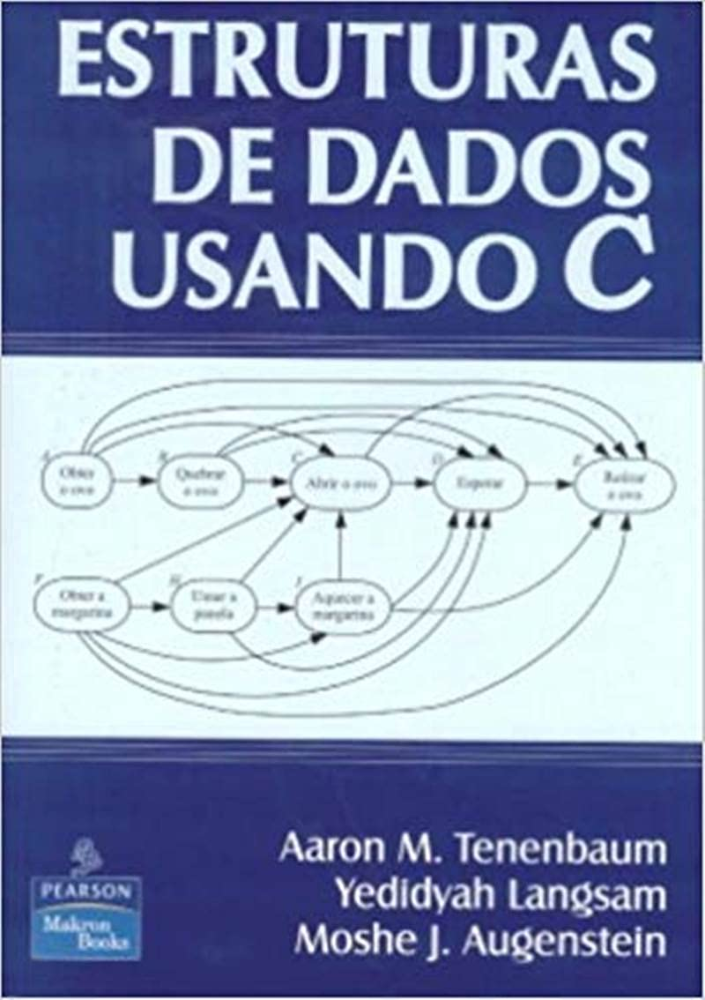 | [Estruturas de Dados Usando C](/livros/estruturas_de_dados_usando_c.pdf) | TENENBAUM, A. M., LANGSAM, Y., AUGENSTEIN, M. |  |
| 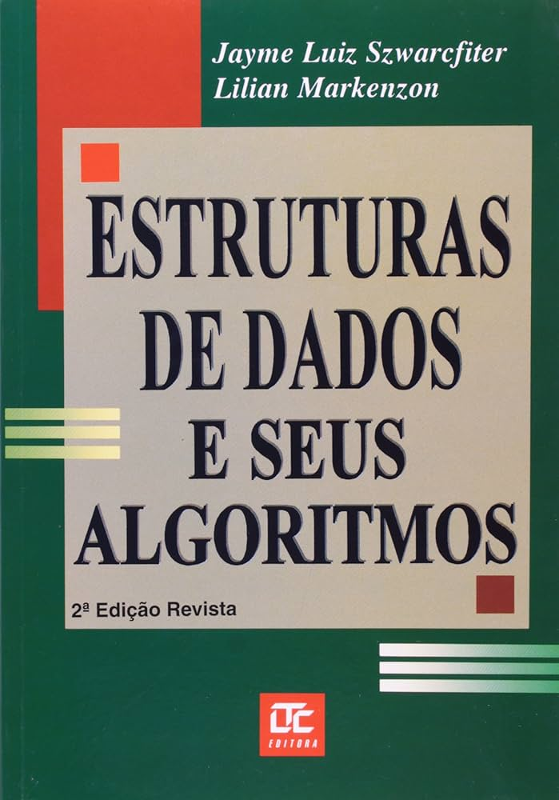 | [Estruturas de Dados e seus Algoritmos 2ed](/livros/estruturas_de_dados_e_seus_algoritmos_2ed.pdf) | SZWARCFITER, J. L., MARKENZON, L. |  |
| 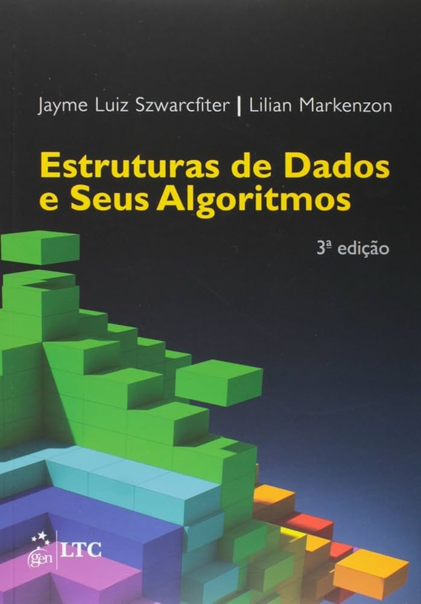 | [Estruturas de Dados e seus Algoritmos 3ed](/livros/estruturas_de_dados_e_seus_algoritmos_3ed.pdf) | SZWARCFITER, J. L., MARKENZON, L. |  |
| 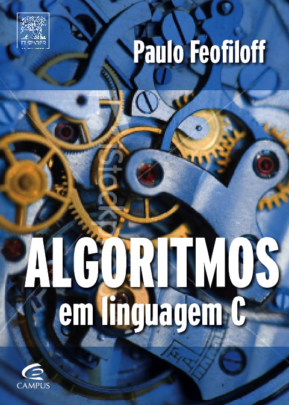 | [Algoritmos em Linguagem](/livros/algoritmos_em_linguagem_c.pdf) | FEOFILOFF, P. |  |
#
## ALGORITMOS E ESTRUTURAS DE DADOS 2
Árvores: formas de representação, recursão em árvores, árvores binárias, árvores binárias de busca, árvores balanceadas (AVL e rubro-negras). Filas de prioridades. Heaps, Heapsort. Hashing: tipos de funções de hashing; tratamento de colisões. Definições de Grafos. Estruturas de Dados para representação de grafos. Algoritmos básicos em grafos.
#
| Livro | Nome da Obra | Autor | Idioma |
|------------|------------|------------|------------|
|  | [Estruturas de Dados Usando C](/livros/estruturas_de_dados_usando_c.pdf) | TENENBAUM, A. M., LANGSAM, Y., AUGENSTEIN, M. |  |
|  | [Estruturas de Dados e seus Algoritmos 2ed](/livros/estruturas_de_dados_e_seus_algoritmos_2ed.pdf) | SZWARCFITER, J. L., MARKENZON, L. |  |
|  | [Estruturas de Dados e seus Algoritmos 3ed](/livros/estruturas_de_dados_e_seus_algoritmos_3ed.pdf) | SZWARCFITER, J. L., MARKENZON, L. |  |
|  | [Algoritmos em Linguagem](/livros/algoritmos_em_linguagem_c.pdf) | FEOFILOFF, P. |  |
#
## ANÁLISE E PROJETO DE ALGORITMOS
Medidas de complexidade, análise assintótica de limites de complexidade para algoritmos iterativos e recursivos, técnicas de prova de cotas inferiores. Corretude de Algoritmos. Exemplos de análise de algoritmos. Técnicas de projeto de algoritmos: dividir para conquistar, programação dinâmica, algoritmos gulosos. Introdução à NP-Completude.
#
| Livro | Nome da Obra | Autor | Idioma |
|------------|------------|------------|------------|
| 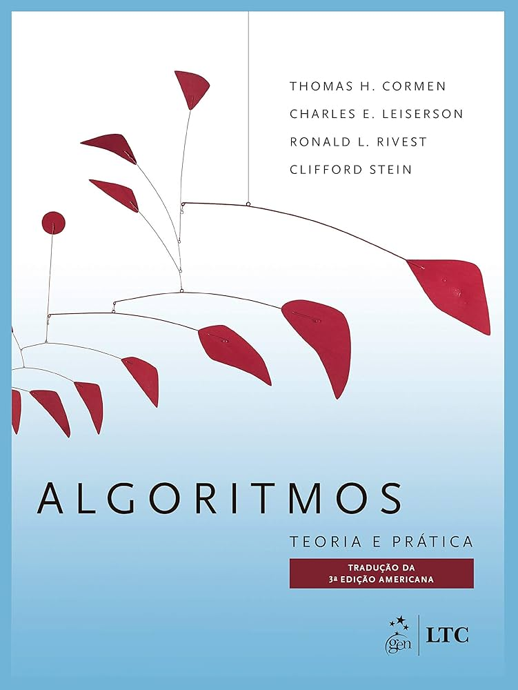 | [ Algoritmos: Teoria e Prática. 3ed](/livros/algoritmos_teoria_e_pratica_3ed.pdf) | CORMEN, T. H.; LEISERSON, C. E.; RIVEST, R. L.; STEIN, C. |  |
| 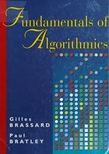 | [Fundamentals of Algorithmics](/livros/fundamentals_of_algorithms.pdf) | BRASSARD, G; BRATLEY, P. |  |
| 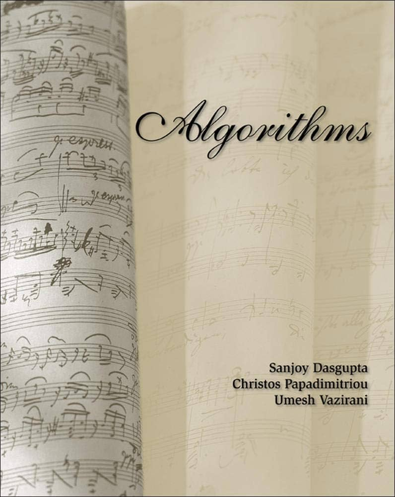 | [Algoritmos](/livros/algoritmos.pdf) | PAPADIMITRIOU, C. H.; VAZIRANI, U. V. |  |
#
## ARQUITETURA DE COMPUTADORES
Visão geral dos computadores modernos. Evolução da arquitetura dos computadores. Memória e representação de dados e instruções. Processador, ciclo de instrução, formato e endereçamento. Noções básicas de programação em linguagem de montagem. Dispositivos de entrada e saída. Sistemas de interconexão (barramentos). Interfaceamento e técnicas de entrada e saída. Hierarquia de memória. Introdução a arquiteturas paralelas e métricas de desempenho.
#
| Livro | Nome da Obra | Autor | Idioma |
|------------|------------|------------|------------|
| 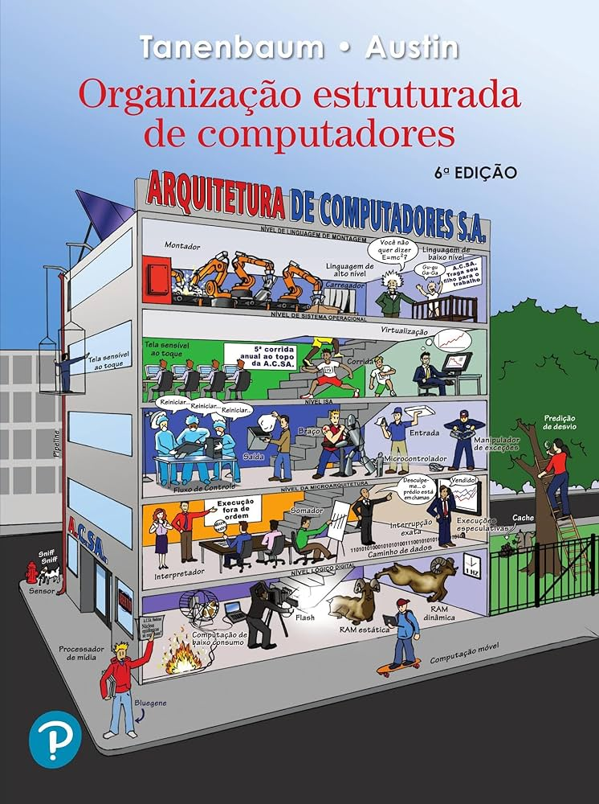 | [Organização Estruturada de Computadores 6ed](/livros/organizaao_estruturada_de_computadores_6ed.pdf) | TANENBAUM, A. |  |
| 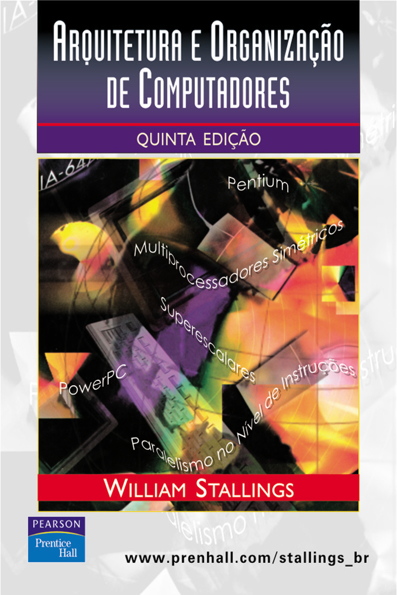 | [Arquitetura e Organização de Computadores 5ed](/livros/arquitetura_e_organizaao_de_computadores_5ed.pdf) | STALLINGS, W. |  |
| 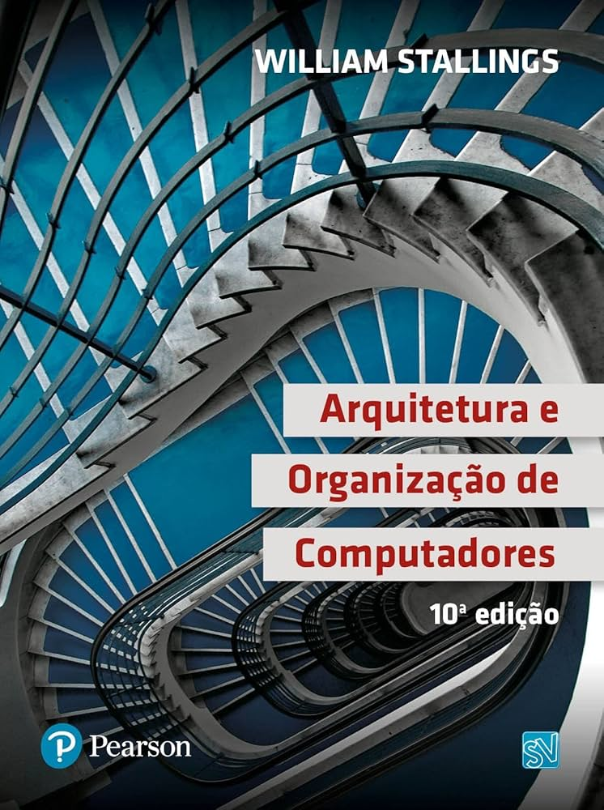 | [Arquitetura e Organização de Computadores 10ed](/livros/arquitetura_e_organizaao_de_computadores_10ed.pdf) | STALLINGS, W. |  |
| 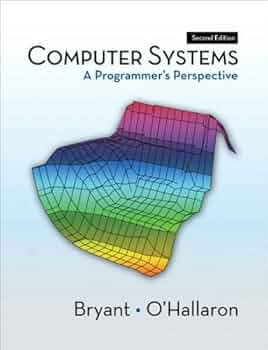 | [Computer Systems: A Programmer’s Perspective 2ed](/livros/computer_systems_a_programmers_erspective_2ed.pdf) | BRYANT, R.; O’RALLARON, D. |  |
| 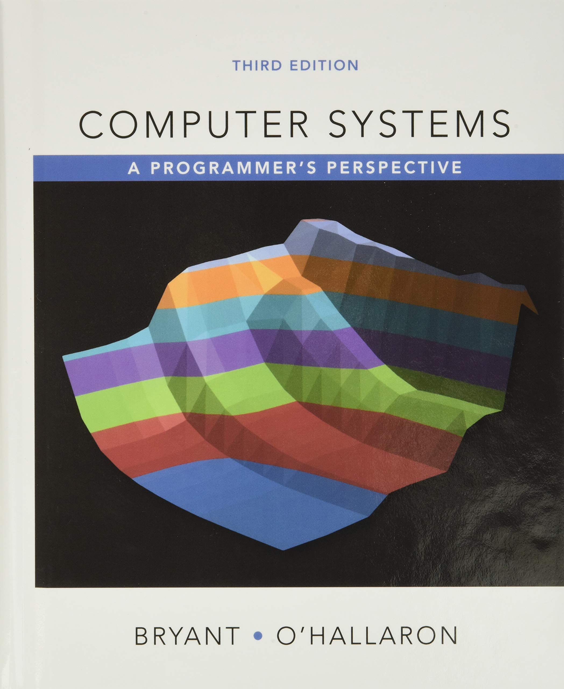 | [Computer Systems: A Programmer’s Perspective 3ed](/livros/computer_systems_a_programmers_erspective_3ed.pdf) | BRYANT, R.; O’RALLARON, D. |  |
#
## BANCO DE DADOS
Conceitos básicos de Banco de Dados. Modelo relacional. Linguagens para Banco de Dados: álgebra relacional, cálculo relacional e SQL. Modelo Entidade-Relacionamento e extensões. Mapeamento ER-relacional. Normalização.
#
| Livro | Nome da Obra | Autor | Idioma |
|------------|------------|------------|------------|
| 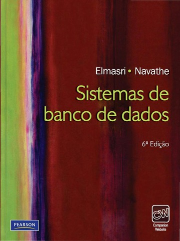 | [Sistemas de Banco de Dados 6ed](/livros/sistemas_de_banco_de_dados_6ed.pdf) | ELMASRI, R.; NAVATHE, S. B.  |  |
|  | [Sistema de Banco de Dados 5ed](https://drive.google.com/file/d/1Vmh5b8JzCtqae9y0A4KlQDqkTaem31Ov/view?usp=drive_link) | SILBERSCHATZ, A.; KORTH, H.F.; SUDARSHAN, S. |  |
| 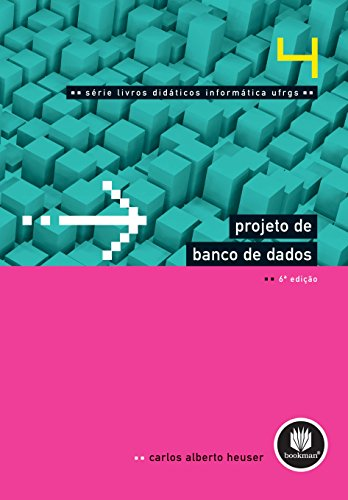 | [Projeto de Banco de Dados 6ed](/livros/projeto_de_banco_de_dados_6ed.pdf) | HEUSER, C. A. |  |
#
## CÁLCULO 1A
Números reais. Funções reais de uma variável real e suas inversas. Noções sobre cônicas. Limite e continuidade. Derivadas e aplicações. Polinômio de Taylor. Integrais. Técnicas de Integração. Integrais impróprias. Aplicações.
#
| Livro | Nome da Obra | Autor | Idioma |
|------------|------------|------------|------------|
| 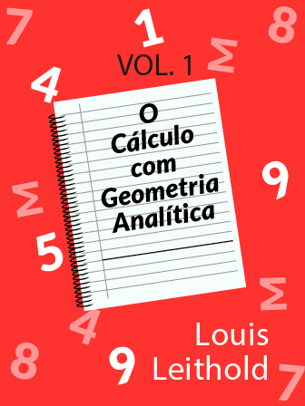 | [O cálculo com geometria analítica V1 3ed](/livros/o_calculo_com_geometria_analitica_v1_3ed.pdf) | LEITHOLD, L.n|  |
| 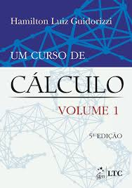 | [Um curso de cálculo V1 5ed](/livros/um_curso_de_calculo_v1_5ed.pdf) | GUIDORIZZI, H. L |  |
|  | [Um curso de cálculo V1 6ed](/livros/um_curso_de_calculo_v1_6ed.pdf) | GUIDORIZZI, H. L |  |
| 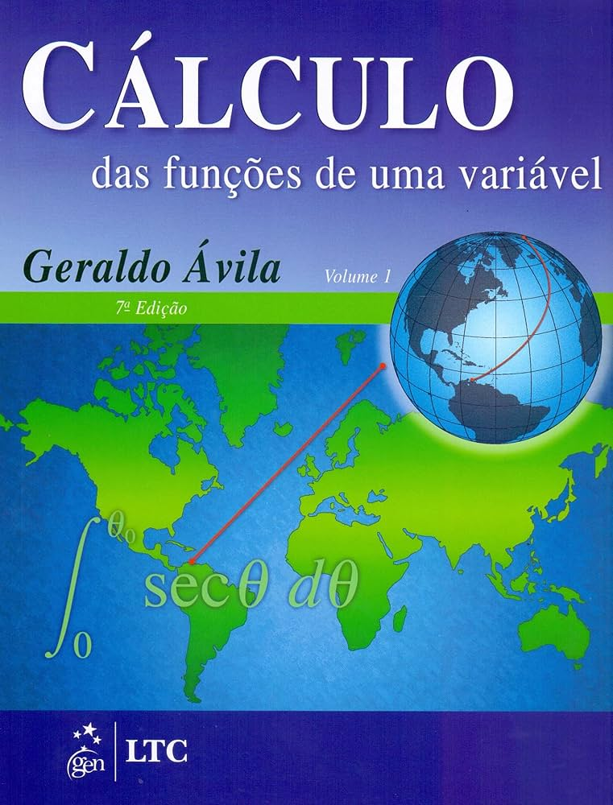 | [Cálculo das funções de uma variável V1 7ed](/livros/calculo_das_funoes_de_uma_variavel_v1_7ed.pdf) | ÁVILA, G. S. S. |  |
|  | [Cálculo V1 5 ed](/livros/calculo_v1_5ed.pdf) | STEWART, J.  |  |
| 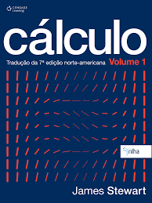 | [Cálculo V1 7 ed](/livros/calculo_v1_7ed.pdf) | STEWART, J.  |  |
#
## COMPUTAÇÃO E SOCIEDADE
História da computação. Estudo e análise de casos de aplicação de computadores na sociedade e para o meio ambiente. Subáreas da computação e áreas interdisciplinares. Importância e desafios da computação no Brasil e no mundo. Cursos de computação e aspectos profissionais: tipos de cursos, perfis profissionais, demanda do mercado, organizações e associações na área, regulamentação da profissão. Leis e normas relacionadas à Informática. Questões ambientais, raciais, de saúde e de inclusão digital relacionadas à Computação. Ética na Computação. Empresas de tecnologia da informação. Incubadoras de empresas
#
| Livro | Nome da Obra | Autor | Idioma |
|------------|------------|------------|------------|
| 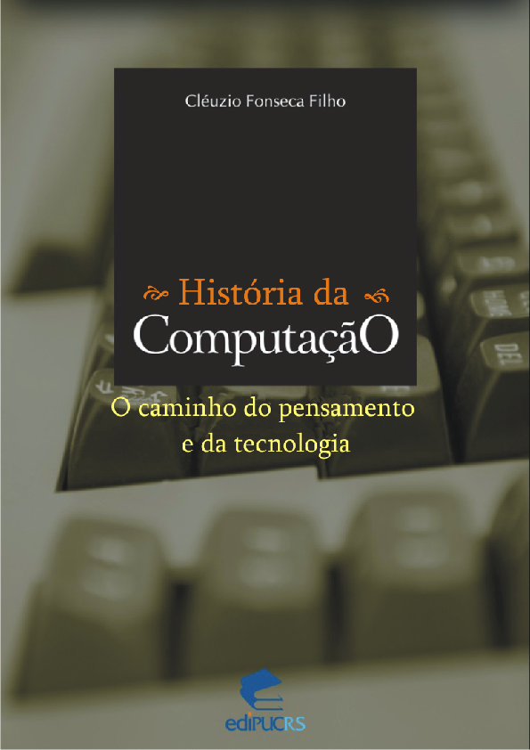 | [História da computação: O Caminho do Pensamento e da Tecnologia](/livros/histooria_da_computacao_o_caminho_do_pensamento_e_da_tecnologia.pdf) | FONSECA FILHO, C. |  |
